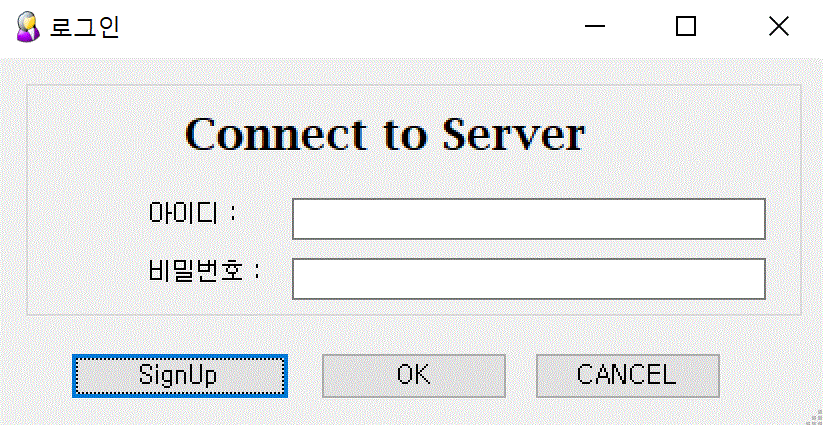

:sectnums:

== 사용자 설정 ==
프로그램을 실행하면 로그인 창이 실행된다. 이미 계정을 갖고 있다면 자신의 ID 와 암호를 입력하고, 아직 계정이 없는 경우 'SignUp' 버튼을 눌러서 사용자 생성 화면으로 이동한다.

. login 화면

=== 사용자 생성 ===
새로운 계정을 생성하는 화면에서 사용자 ID 와 암호, 그리고 추가 정보들을 입력한다. 사용자 ID 와 암호는 필수 항목이다.
사용자 ID는 개인에게 부여받은 SAMSUNG INTERNATIONAL COMPANY 입사시 확정한 메일 아이디로 함을 원칙으로 한다.

image::images/signup.gif[800,400]

시스템 관리자의 사용 승인이 이루어지면
새롭게 생성한 계정 정보를 사용하여 로그인 할 수 있다.
