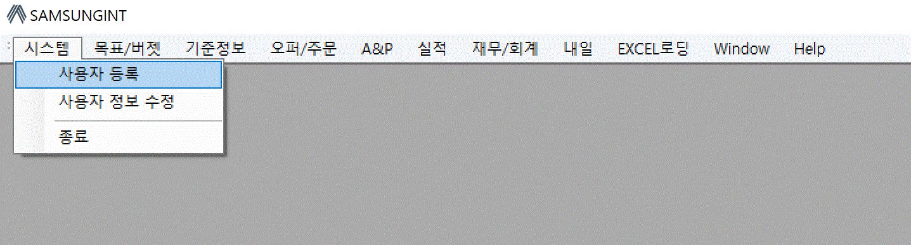

:sectnums:

== File 메뉴 ==
프로그램의 메인창에서 [File] 메뉴에 있는 기능을 설명한다.

=== 사용자 생성 ===
로그인 창에서도 사용자 생성을 할 수 있고, [File]->[사용자 등록] 메뉴를 통해서도 새로운 계정을 생성할 수 있다. 사용자 ID 와 암호, 그리고 추가 정보들을 입력한다. 사용자 ID 와 암호는 필수 항목이다.

image::images/signup.gif[800,400]

=== 사용자 정보 수정 ===
현재 로그인한 사용자의 정보를 수정하는 기능이다.

image::images/edit_user.gif[800,600]

사용자 정보 수정 화면에서는 기본 정보, 암호 변경, 비용 계좌 정보 및 사용자 그룹을 변경할 수 있다.

. 기본 정보 : 사용자 이메일과 연락처 정보를 입력한다.
. 암호 변경 : 암호를 변경하고자 하는 경우 기존 암호와 새로운 암호를 입력한다.
. 비용 계좌 정보 : 개인 비용 계좌를 입력한다.
. 권한 정보 : 사용자가 속한 그룹을 변경한다.

IMPORTANT: 사용자 권한 정보는 일반 사용자는 변경할 수 없고, SUPER USER 권한을 갖고 있는 사용자만 변경할 수 있다.
