:sectnums:

== EXCEL 로딩 ==
시스템에서 사용하는 주요 데이터들은 [EXCEL 로딩] 기능을  이용하여 시스템으로 업로드 할 수 있다. 상품 데이터, 매출 데이터 등이 그 예라고 할 수 있다. 본 장에서는 Excel 을 이용하여 다양한 데이터들을 업로드 하는 방법에 대하여 설명하겠다.

=== 상품 데이터 EXCEL ===
벤더에서 제공하는 상품 데이터들을 업로드 하는 방법에 대하여 설명한다. 상품 데이터를 업로드 하기 위해서는 프로그램에서 제공하는 템플릿 파일에 업로드할 상품 데이터의 정보를 입력하여야 한다.

==== 상품 데이터 템플릿 파일  ====
상품 데이터를 업로드하기 위한 템플릿 파일은 프로그램 설치 경로 아래  **template\product.xlsx** 이다.

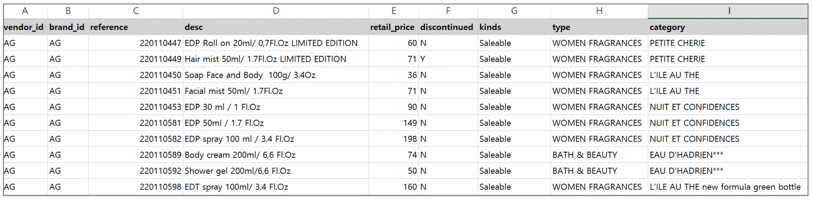

위의 파일을 열어보면 제품 정보를 업로드 하기 위한 컬럼 정보를 확인할 수 있다. 아래는 해당 컬럼 정보에 대한 설명이다.

.상품 데이터 템플릿 컬럼 설명
|===
|컬럼명 | 컬럼 설명 | 필수 여부
|vendor_id | 벤더 아이디 | O
|brand_id  | 해당 상품의 브랜드 아이디 | O
|reference | 벤더에서 부여한 상품 reference 번호 | O
|desc    | 상품 설명 | O
|discontinued | 단종여부(Y/N)| O
|retail_price | 상품 판매 가격 (숫자만 가능) | O
|kinds | 상품 종류 (saleable/posm/sample 만 가능) | O
|type | 상품 type | O
|category | 상품 category | O
|subcategory| 상품 subcategory | O
|invoice_price| 인보이스 가격(숫자만 가능) | X
|size | 상품 크기 | X
|eancode | 상품 ean Code | x
|moq | 상품 최소주문수량 | X
|packing_unit | 상품 포장 단위 | X
|barcode | 상품barode | X
|incoterm| incoterm |X
|origin| 상품 원산지 | X
|===

TIP: 해당 상품 컬럼 외에 추가로 입력해야 할 속성이 있는 경우, 기존 템플릿 파일에 컬럼을 추가하고 해당 속성 값을 입력하면, 프로그램에서 자동으로 해당 속성을 인식하여 업로드 한다.

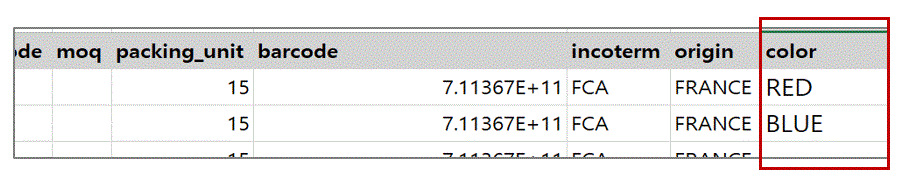

TIP: 상품을 업로드 하는 과정에서 기존 존재하는 제품이 있으면 현재 Excel 에 있는 데이터를 기준으로 상품 데이터를 업데이트 하게 되고, 존재하는 제품이 아니면 새로운 제품 정보를 생성한다.

위 그림을 보면 추가로 "color" 라는 제품 속성이 필요로 한 경우, "color" 라는 속성을 추가하고 값을 채워 넣은 것을 확인할 수 있다.

==== 상품 데이터 업로드 ====
상품 데이터 템플릿 파일에 제품 정보를 모두 입력한 후에는 시스템을 이용하여 해당 정보를 시스템에 업로드 하여야 한다. 업로드 하기 위해서 [EXCEL 로딩] -> [상품정보 EXCEL] 메뉴를 클릭한다.

===== 상품 데이터 Excel 파일 선택 =====

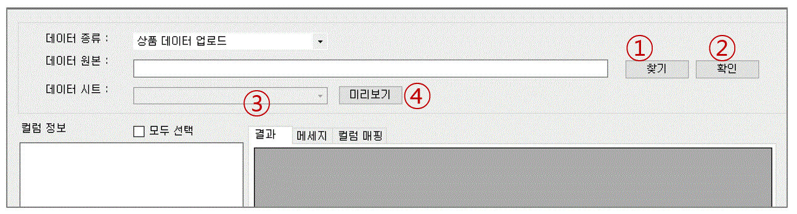

. 찾기: 상품 Excel template 파일의 위치를 지정한다.
. 확인: template 파일 위치를 지정했으면 [확인] 버튼을 눌러서 Excel 파일 정보를 읽어 온다.
. 데이터 시트 지정 : [확인] 버튼을 누르면 [데이터 시트 ] 콤보 박스에 선택한 Excel 파일의 시트명이 보이게 된다. 해당 시트 중에서 업로드할 상품 정보가 존재하는 시트명을 선택한다.
. 미리보기 : Excel 시트를 선택한 후에는 [미리보기] 버튼을 클릭하여, 업로드할 상품 정보 데이터를 확인한다.

===== 상품 데이터 미리보기 =====
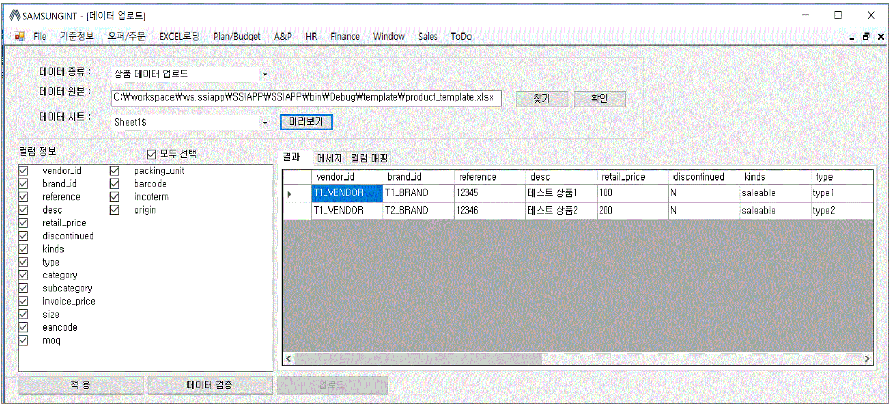

[미리보기] 버튼을 클릭하면 입력한 상품 정보 데이터를 확인할 수 있다. 좌측에는 Excel 에 있는 컬럼 정보를, 우측에는 입력한 상품 데이터을 확인할 수 있다.

TIP: 일반적인 경우는 아니지만 만일, 특정 컬럼들만 선택해서 데이터를 업로드 하고 싶을 때에는 [컬럼 정보] 화면에서 원하는 컬럼을 선택하고, 하단의 [확인 ] 버튼을 클릭하면 선택한 컬럼 기준으로 상품 데이터를 업로드 하게 된다.

===== 데이터 검증 =====
상품 데이터는 업로드 하기 전에 데이터 검증 과정을 거치게 된다. 화면 하단의 [데이터 검증] 을 클릭하여 데이터 검증 과정을 수행한다. 이 과정에서 검증하는 항목은 아래와 같다.

.상품 데이터 검증 항목
|===
|검증 항목 | 설명
|Vendor 유효성 | 입력한 벤더 ID가 존재하는지 확인
|Brand 유효성  | 입력한 브랜드가 존재하는지 확인
|상품 종류 유효성 | 입력한 데이터에 saleable/posm/sample 이외의 값이 있는지 확인
|===

검증 과정에서 오류가 있으면 프로그램 화면에서 해당 오류를 확인할 수 있다.

image::images/product_verify_err.gif[]

검증 과정에서 문제가 없는 경우 데이터 검증에 성공했다는 메세지를 확인할 수 있다.

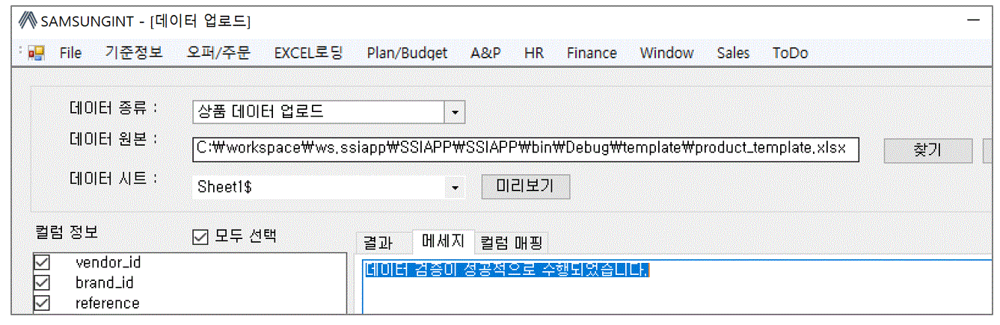

===== 데이터 업로드 =====
검증 과정을 마쳤으면 하단의 [업로드] 버튼을 클릭하여, 데이터를 업로드한다.  성공적으로 업로드 되었으면 아래와 같은 메세지를 확인할 수 있다.

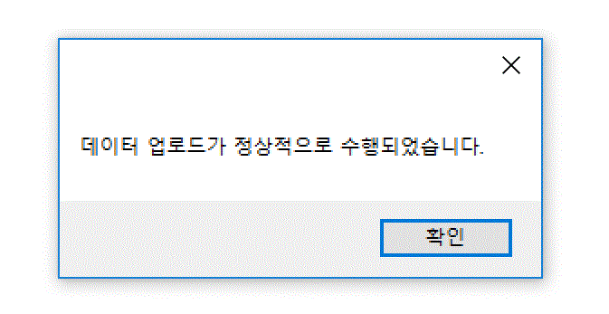

업로드한 데이터를 확인하려면 [기준정보] -> [상품정보] 메뉴를 통하여, 해당 벤더를 선택하고 제품을 검색해서 정상적으로 상품 정보가 조회되는지 확인한다.

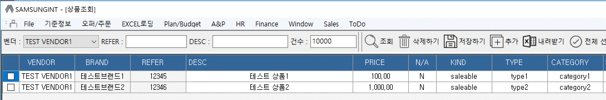

=== 브랜드별 입점정보 EXCEL ===
벤더에서 제공하는 제품의 입점 정보를 관리하는 화면이다. 고객별로 어떠한 브랜드 제품이 공급되고 있는지에 대한 정보를 Excel 을 통하여 업로드 하게 된다. 이러한 데이터를 업로드 하기 위한 기본 템플릿 파일은 제공되지 않는다. 아래와 같은 과정을 통하여 데이터를 업로드 하면 된다.

. 등록하고자 하는 벤더 상품 조회
. 조회한 상픔 데이터 EXCEL로 다운 로드
. 다운 로드한 EXCEL에 입점 정보 입력
. 수정한 EXCEL 파일 업로드

위의 과정을 자세히 설명하겠다.

====  대상 상품 조회 ====

상품 정보 조회 방법::
프로그램 메뉴에서 [기준 정보] -> [브랜드별 입점 정보] 를 클릭한다.

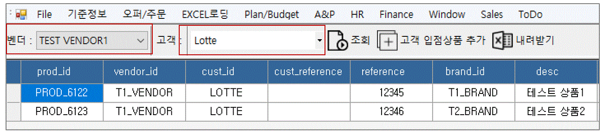

조회::
조회하려는 벤더와 고객을 선택하여 상품을 조회한다. 조회된 화면을 보면 cust_reference 가 빈 값으로 보이는 상품들이 존재한다. 해당 상품들의 의미는 벤더가 공급하는 상품으로는 등록되어 있지만, 선택한 고객의 입점 상품으로는 등록되어 있지 않은 상태를 의미한다.

내려받기::
조회된 상품을 [내려받기] 버튼을 클릭하여 EXCEL로 저장한다.

image::images/product_to_excel.gif[]

엑셀이 실행되면서 상품 데이터를 확인할 수 있다. 해당 파일을 적당한 이름으로 저장한다.

==== 입점 정보 입력 ====

 저장한 엑셀 파일의 [cust_reference ] 컬럼에 고객이 부여한 상품 reference 번호를 입력한다. 고객이 부여한 cust_reference 가 존재하지 않는 경우,  상품의 reference 번호를 그대로 넣어준다.

IMPORTANT: 컬럼명은 cust_id, cust_refernece 를 꼭 지켜줘야 한다. 그렇지 않은 경우 제품이 정상적으로 업로드 되지 않는다. cust_reference 는 벤더가 부여한 원래 제품 referenece 가 아니고, 고객이 부여한 reference 임에 유의한다.

참고로 현재 등록되어 있는 고객 ID 는 아래와 같다.

.고객 ID 정보
|===
|고객 ID | 고객이름
|AIR_BUSAN	|Air Busan
|ASIANA_AIRLINES	|Asiana Airlines
|CITY_PLUS	|CITY PLUS
|DONGWHA	|Dongwha
|ENTAS	|Entas
|GALLERIA	|Galleria
|GRAND	|Grand
|HDC	|HDC
|JDC	|JDC
|KOREAN_AIR	|Korean Air
|LOTTE|	Lotte
|LOTTE_MART	|Lotte Mart
|NULBO	|Nulbo
|SHILLA	|Shilla
|SHINSEGAE|	Shinsegae
|SSI	|SSI
|TRAVEL_PLACE	|Travel Place
|T-WAY	|T-Way
|===

==== 입점 데이터 업로드 ====
해당 데이터 입력이 완료 되었으면 정보를 입력한 Excel 파일을 이용하여, 입점 정보 데이터를 업로드 해야 한다.

===== 입점정보 Excel 선택 =====
메뉴의 [EXCEL 로딩] -> [브랜드별 입점정보 EXCEL] 을 클릭한다.  실행된 화면에서, 데이터 종류가 '브랜드 입점정보 데이터 업로드' 로 되어 있는지 확인한다. 확인 후 해당 화면에서 [찾기] 버튼을 클릭하여, 금방 작성한 Excel 파일을 선택한다.

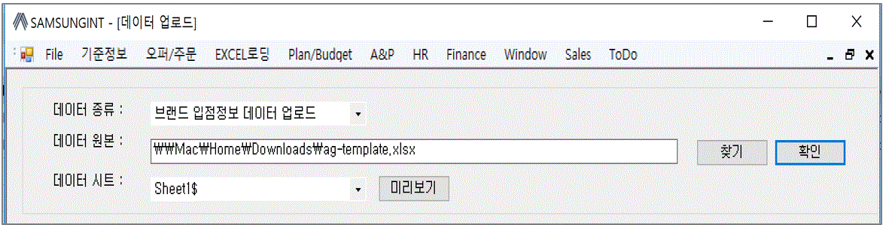

. 찾기: 입점정보 Excel template 파일의 위치를 지정한다.
. 확인: template 파일 위치를 지정했으면 [확인] 버튼을 눌러서 Excel 파일 정보를 읽어 온다.
. 데이터 시트 지정 : [확인] 버튼을 누르면 [데이터 시트 ] 콤보 박스에 선택한 Excel 파일의 시트명이 보이게 된다. 해당 시트 중에서 업로드할 입점 상품 정보가 존재하는 시트명을 선택한다.
. 미리보기 : Excel 시트를 선택한 후에는 [미리보기] 버튼을 클릭하여, 업로드할 입점 상품 정보 데이터를 확인한다.

===== 데이터 미리보기 =====
[미리보기] 버튼을 클릭하여 업로드할 데이터를 확인한다.

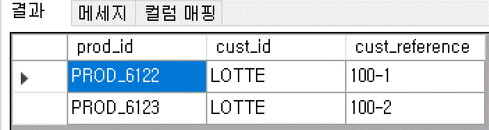

미리보기에서 입점 상품 데이터를 업로드하기 위한 필수 컬럼인 [prod_id],[cust_id],[cust_reference] 컬럼에 데이터가 올바르게 보이는지 확인한다.

===== 데이터 업로드 =====
검증 과정을 마쳤으면 하단의 [업로드] 버튼을 클릭하여, 데이터를 업로드 합니다.  성공적으로 업로드 되었으면 아래와 같은 메세지를 확인할 수 있다.

===== 데이터 확인 =====
데이터 업로드가 정상적으로 수행되었으면, 해당 데이터가 정상적으로 로딩되었는지 확인해야 한다. 프로그램의 [기준정보] -> [브랜드별 입점 정보] 메뉴를 클릭한다. 화면에서 검색하고자 하는 벤더와 고객을 선택하고 [조회] 버튼을 클릭하여, 금방 업로드한 데이터가 조회되는지 확인한다.

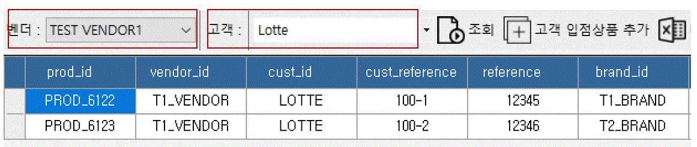

=== 거래 기본 정보 EXCEL ===
'거래 기본 정보 Excel' 기능은 고객 지점과 브랜드 사이의 거래에 대한 기본 정보를 입력하는 기능이다.이러한 데이터를 업로드 하기 위한 기본 템플릿 파일은 제공되지 않는다. 아래와 같은 과정을 통하여 데이터를 업로드 하면 된다.

. 등록하고자 하는 거래 기본 정보 조회
. 조회한  데이터 엑셀로 다운 로드
. 다운 로드한 엑셀에 거래 기본 데이터 입력
. 수정한 엑셀 파일 업로드

위의 과정을 자세히 설명하겠다.

==== 거래 기본 정보 조회 ====

image::images/branch_brand.gif[]

. 브랜치: 고객 지점을 선택한다.
. 브랜드: 브랜드를 선택한다.
. 조 회 : 선택한 고객 지점과 브랜드 간의 거래 정보를 조회한다. 정보가 존재하지 않는 경우 데이터는 조회되지 않는다. 데이터가 없더라도 템플릿으로 사용할 Excel 파일을 만드는 과정이기 때문에 문제 되지 않는다.
. 내려받기 : 조회한 내용을 엑셀로 내려 받고 적당한 이름으로 저장한다.

==== 거래 기본 정보 입력 ====
저장한 Excel 파일에 거래 정보 데이터를 입력한다.

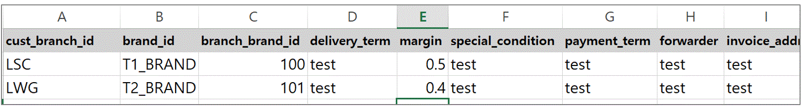

현재 시스템에 등록되어 있는 고객 지점 ID 와 브랜드 ID 는 아래와 같다.

.고객 지점 ID 정보
|===
|고객 지점 ID | 고객 지점 이름
|cust_branch_id	|cust_branch_name
|AAL	|AAL
|AIR_BUSAN|	AIR BUSAN
|AIR_SEOUL	|AIR SEOUL
|CITY	| CITY PLUS INCHEON
|DSB	|DONGWHA BTQ
|DSG	|DONGWHA
|Enats	|Entas
|ESTAR	|E*STAR
|GRAND	|GRAND
|HDC	|HDC
|HSG	|HANWHA SEOUL
|JDC	|JDC
|JEJU_AIR	|JEJU AIR
|JIN_AIR	|JIN AIR
|KAL_CATERING|KAL (CATERING)
|KAL_GMPDU	|KAL (GMPDU)
|KAL_GMPUC	|KAL (GMPUC)
|KAL_ICNUCD|KAL (ICNUCD)
|LBB|	LOTTE BUSAN BTQ
|LBG|LOTTE BUSAN
|LCG|LOTTE COEX
|LGB|	LOTTE GIMHAE BOUTIQUE
|LGG|LOTTE GIMHAE
|LIC|LOTTE I|NCH|EON
|LM|LOTTE MART
|LO|LOTTE ONLINE
|LSB|LOTTE SEOUL BTQ
|LSC|LOTTE SEOUL
|LWB|LOTEE WORLD BTQ
|LWG|LOTTE WORLD
|Nulbo|Nulbo
|SCG	|SHINSEGAE CENTUM
|SDC|SHILLA HDC
|SDGO|SHILLA DAEGU
|SGG|SHILLA GIMPO
|SHA|SHILLA HOTEL ARCADE
|SIC|SHILLA INCHEON
|SJB|SHILLA JEJU BTQ
|SJG|SHILLA JEJU
|SO|SHILLA ONLINE
|SSB|SHILLA SEOUL BTQ
|SSC|	SHILLA SEOUL
|SSGG|SHINSEGAE DEP KANGNAM
|SSGI	|SHINSEGAE INCHEON
|SSGO	|SHINSEGAE ONLINE
|SSGS|	SHINSEGAE SEOUL
|SSI	|삼숭본사
|T-WAY	|T-WAY
|===

.브랜드 ID 정보
|===
| 브랜드 ID | 브랜드명
|AG	|Annick Goutal Perfume
|ALEX 	|ALEX
|ARDENTE	|ARDENTE
|AVENE	|AVENE
|BALLY|	Bally
|BALVENIE	|Balvenie
|BREO	|BREO
|BROSWAY	|BROSWAY
|BUCKLEY	|BUCKLEY
|BURBERRY	|BURBERRY
|CK	|Calvin Klein
|CLARINS	|Clarins
|CNP	|Hermes Perfume
|CO	|Marvel
|DAIM	|DAIM
|DALMORE	|DALMORE
|DKERN	|DYBERG/KERN
|DKNY	|DKNY
|DONGINBI	|Donginbi
|DRAMBUIE	|Drambuie
|E.ARMANI	|Emporio Armani
|FEODORA	|FEODORA
|FERRAGAMO	|Ferragamo
|FLIK |FLAK	FLIK FLAK
|FOGAL|	Fogal
|GJ	|Georg Jensen
|GLENFIDDICH	|Glenfiddich
|GRANTS	|Grants
|HACHEZ	|HACHEZ
|HAMILTON	|Hamilton
|HC	|HIPPIE CHIC
|HENDIRCK'S|	Hendirck's
|INEU	|INEU
|JLB	|JohnLobb
|KARTEL	|KARTEL
|KINNIVIE	|Kinnivie
|LACHO|	Lacho
|LB	|Luigi Borrelli
|LEXON|	LEXON
|LF	|Life Time
|LONGINE|	Longine
|M.SHOULDER	|Monkey Shoulder
|MBM	MARC |JACOBS
|MIRABELL|	MIRABELL
|MISAKI	|MISAKI
|MKORS|	Michael Kors
|NIKE	|Nike
|OG	|Ogram
|OREO	|Oreo
|PASHMA|	PASHMA
|PGH	|Peiro Guidi
|PLL|	Perfume Lolita Lempicka
|RADO	|RADO
|S.JERRY	|Sailor Jerry
|SANOTACT	|SANOTACT
|SEMPE	|Sempe
|SKAGEN	|SKAGEN
|SPEEDO |	SPEEDO
|SWAROVSKI	|Swarovski
|SWATCH	|SWATCH
|TB	|Travel Blue
|TIE-UPS	|Tie-Ups Belt
|TISSOT	|Tissot
|TOBLERONE	|TOBLERONE
|V.WESTWOOD	|Vivienne Westwood
|WENGER|	WENGER
|XELLENT|	XELLENT
|ZERO	|ZERO RH+
|Z-ZOOM	|Z-Zoom
|===

==== 거래 기본 정보 Excel 선택 ====
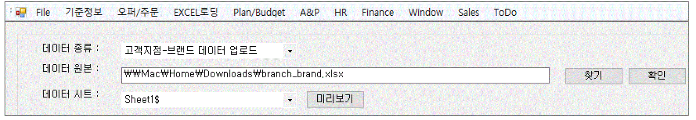

. 찾기: 거래 기본 정보 Excel template 파일의 위치를 지정한다.
. 확인: template 파일 위치를 지정했으면 [확인] 버튼을 눌러서 Excel 파일 정보를 읽어 온다.
. 데이터 시트 지정 : [확인] 버튼을 누르면 [데이터 시트 ] 콤보 박스에 선택한 Excel 파일의 시트명이 보이게 된다. 해당 시트 중에서 업로드할 거래 기본 정보가 존재하는 시트명을 선택한다.
. 미리보기 : Excel 시트를 선택한 후에는 [미리보기] 버튼을 클릭하여, 업로드할 거래기본 정보 데이터를 확인한다.

===== 데이터 미리보기 =====
[미리보기] 버튼을 클릭하여 업로드할 데이터를 확인한다.

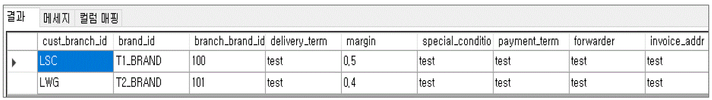

===== 데이터 업로드 =====
검증 과정을 마쳤으면 하단의 [업로드] 버튼을 클릭하여, 데이터를 업로드 합니다.  성공적으로 업로드 되었으면 아래와 같은 메세지를 확인할 수 있다.

===== 데이터 확인 =====
데이터 업로드가 정상적으로 수행되었으면, 해당 데이터가 정상적으로 로딩되었는지 확인해야 한다. 프로그램의 [기준정보] -> [거래 기본 정보] 메뉴를 클릭한다. 화면에서 검색하고자 하는 고객 지점과 브랜드를 선택하고 [조회] 버튼을 클릭하여, 금방 업로드한 데이터가 조회되는지 확인한다.

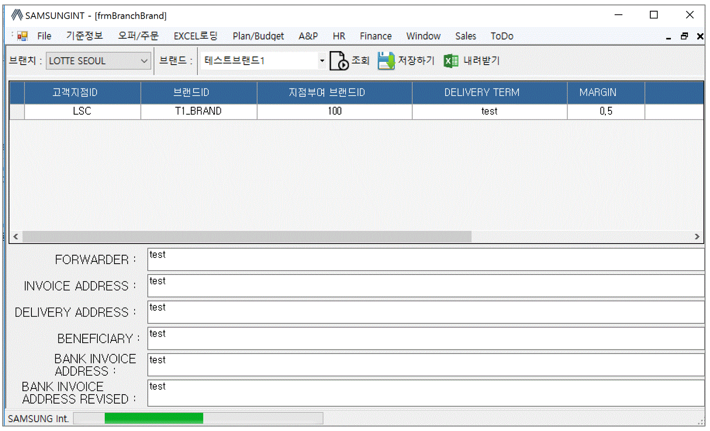

=== 매출 실적 데이터 업로드 ===
매출 데이터를 업로드 하는 방법에 대하여 설명한다. 다른 데이터와는 달리, 매출 데이터는 정형화된 템플릿 양식을 사용할 수 없다. 다양한 고객으로부터 전달되는 매출 데이터 양식이 표준화 되어 있지 않기 때문이다. 이러한 난점을 해결하기 위하여 STA 시스템에서는 두가지 방식의 업로드 방식을 제공하고 있다. 첫번째는  [컬럼 매핑] 기능을 통한 매출 실적 데이터 업로드이고, 다른 하나는 템플릿 파일을 사용하는 것이다. 해당 기능에 대해서는 아래에서 자세히 설명할 것이다.

=== 매출 실적 EXCEL (컬럼 매핑) ===
컬럼 매핑을 통한 매출 데이터 업로드는 아래와 같은 과정을 거치게 된다.

. 매출 데이터 엑셀 선택
. 엑셀 컬럼과 매출 데이터 컬럼 매핑 (컬럼 매핑 기능 사용시)
. 매출 데이터 업로드

==== 매출 실적 데이터 Excel 파일명 형식 ====
매출 실적을 업로드 하기 위한 Excel 파일명은 아래의 명명 규칙을 준수하여야 한다.
-----
YYYY#MM#벤더ID#브랜드ID#고객지점ID.xlsx
-----

예를 들어 '2018년 1월 Hermes의 Hermes Perfume 이라는 브랜드에 대한 롯데서울 지점 ' 의 매출 데이터 파일은 아래와 같은 엑셀 파일명을 갖고 있어야 한다.
-----
2018#01#CNP#CNP#LSC.xls
-----

 * YYYY: 2018
 * MM : 01
 * 벤더ID : CNP
 * 브랜드ID : CNP
 * 고객지점ID : LSC

IMPORTANT: 위에서 보면 벤더ID 와 브랜드 ID 가 동일하다. 벤더ID 와 브랜드ID 가 동일한 경우도 있고, 다른 경우도 있기 때문에 정확히 확인해야 한다.

==== 매출 실적 Excel 선택 ====
메뉴의 [EXCEL 로딩] -> [매출 실적 EXCEL (컬럼 매핑) ] 을 클릭한다.  실행된 화면에서, 데이터 종류가  '매출 데이터 업로드 (매핑) ' 로 되어 있는지 확인한다.

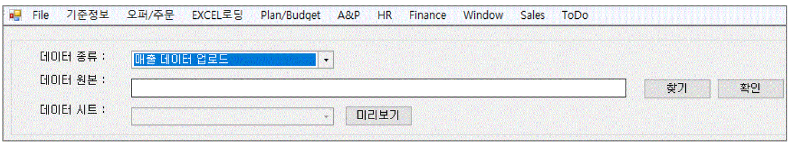
. 찾기: 매출 정보 Excel template 파일의 위치를 지정한다.
. 확인: template 파일 위치를 지정했으면 [확인] 버튼을 눌러서 Excel 파일 정보를 읽어 온다. 이 과정에서 Excel 파일명에 지정한 벤더ID 와 브랜드ID 가 유효한지에 대한 검증작업을 거친다.
. 데이터 시트 지정 : [확인] 버튼을 누르면 [데이터 시트 ] 콤보 박스에 선택한 Excel 파일의 시트명이 보이게 된다. 해당 시트 중에서 업로드할 거래 기본 정보가 존재하는 시트명을 선택한다.
. 미리보기 : Excel 시트를 선택한 후에는 [미리보기] 버튼을 클릭하여, 업로드할 매출 정보 데이터를 확인한다.

==== 매출 실적 데이터 미리보기 ====
화면의 [미리보기] 를 클릭하여 현재 입력된 Excel 의 매출 데이터를 확인한다. 매출 데이터가 어떠한 형식으로 입력되어 있는지 확인한다.

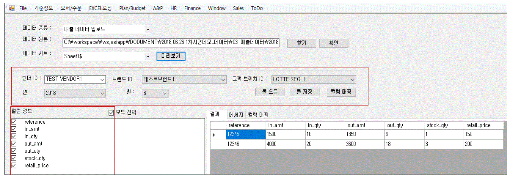

중간 화면에 있는 벤더ID, 브랜드ID, 고객지점ID, 년/월 정보가 올바르게 설정이 되었는지 확인한다. 그리고, 미리보기 창에서 매출 데이터가 올바르게 보이는지 확인하고 [컬럼정보] 란에 지금 설정한 Excel 파일의 컬럼이 올바르게 보이는지 확인한다.

==== 컬럼 매핑 ====
기존의 다른 기준 정보 데이터와는 달리 매출 데이터는 다양한 형식의 입력 데이터를 지원할 수 있어야 하기 때문에 ** 컬럼 매핑 ** 기능을 제공하고있다. 컬럼 매핑 기능이란, 업로드하고자 하는 Excel 의 컬럼과 시스템 데이터베이스의 매출 테이블 컬럼끼리 연결 관계를 지정하는 것이다. 우선 시스템에서 관리하는 매출 테이블의 주요 컬럼은 아래와 같다.

.매출 테이블 주요 컬럼
|===
|컬럼명 | 설명  | 비고|
|vendor_id	| 벤더 ID | 입력파일명에서 제공|
|brand_id	| 브랜드 ID  | 입력파일명에서 제공|
|cust_branch_id	| 고객지점 ID  | 입력파일명에서 제공|
| year	| 년 | 입력파일명에서 제공|
|month	 | 월  | 입력파일명에서 제공|
|reference	 | |벤더 상품 reference |
|cust reference | 고객이 부여한 상품 번호 ||
|in_qty	| 입고량 |  |
|in_amt	| 입고금액 | |
|out_qty	 | 판매량 | |
|out_amt	 |판매금액 | |
|stock_qty  |재고량 ||
|stock_amt	 |재고금액||
|retail_price |판매가격 ||
|sales_id | 매출데이터 구분 ID | 이미 존재하고 있는 매출 데이터를 수정할 때 사용|
|===

매출 테이블의 주요 컬럼에 모두 매핑을 지을 수 없는 경우가 많을 것이다. 최대한 가능한 컬럼까지 매핑을 설정하기를 권한다. 컬럼 매핑을 진행하기 위하여 화면상의 [컬럼 매핑 ] 버튼을 클릭한다.

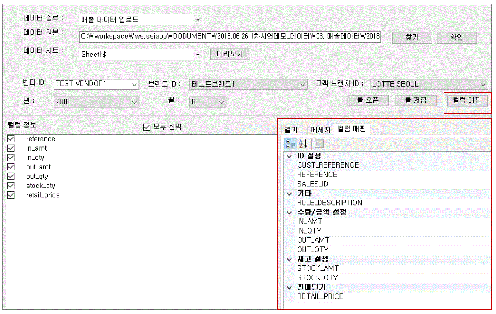

[컬럼 매핑] 버튼을 클릭하면, 컬럼 매핑을 설정할 수 있는 화면이 하단에 생성된다. 현재 보이는 컬럼은 시스템에서 사용하는 매출 테이블 컬럼이다. 해당 컬럼에 데이터를 제공하는 Excel 파일의 컬럼을 지정한다. 해당하는 컬럼이 없는 경우에는 비워 놓는다.

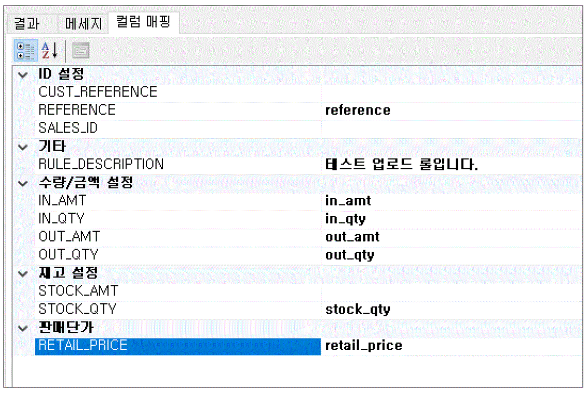

위에서 설정한 컬럼 매핑은 아래와 같은 의미이다.

|===
| 시스템 테이블 컬럼 | Excel 컬럼  | 비고
|CUST_REFERENCE	| 매핑 관계 없음 |
|REFERENCE	| reference  |
|SALES_ID | 매핑 관계 없음|
|RULE DESCRIPTION | 매핑 관계 없음 | 매핑룰을 저장하는데 사용됨. 나중에 매핑룰을 찾을 때 사용되므로, 사용자 본인이 인식하기 좋은 이름으로 설정한다.
|IN_AMT | in_amt |
|IN_QTY | in_qty |
|OUT_AMT | out_amt |
|OUT_QTY | out_qty |
|STOCK_AMT | 매핑 관계 없음 |
|STOCK_QTY | stock_qty |
|===

매핑 관계를 생성했다면, 나중에 재사용 할 수 있게끔 [룰저장] 버튼을 눌러서 룰을 저장할 수 있다.

TIP: [룰오픈] 을 통해서 룰을 불러온 경우 [룰저장] 버튼을 누르면 새로운 이름으로 저장하거나, 기존 룰을 업데이트 할 수 있다.

==== 데이터 유효성 검증 ====
컬럼 매핑이 끝났으면 하단의 [데이터 검증] 버튼을 눌러서 입력할 매출 데이터의 유효성을 검증한다. 현재 버전에서는 입력한 매출 데이터의 상품 reference 번호가 유효한 값인지 여부에 대해서 검증한다.

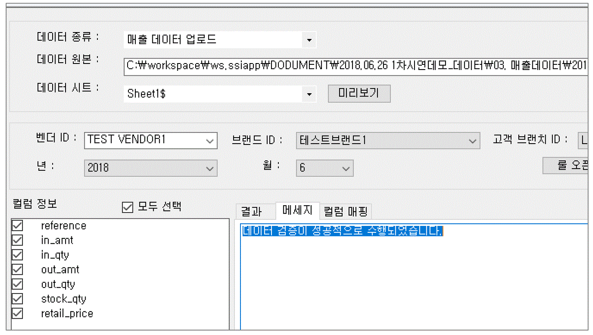

==== 매출 데이터 업로드 ====
데이터 유효성 검증이 성공적으로 수행되었으면, 하단의 [업로드] 버튼을 클릭하여, 매출 데이터를 업로드한다.  성공적으로 업로드 되었으면 아래와 같은 메세지를 확인할 수 있다.

==== 매출 데이터 확인 ====
업로드한 매출 데이터를 확인하기 위해서 프로그램의 [Sales]->[실적정보 조회/수정] 메뉴를 클릭한다. 실행한 화면에서 벤더 정보, 브랜드 정보, 고객 지점 정보, 년/ 월 정보를 설정하고 [검색] 버튼을 클릭한다. 조회된 데이터가 올바른지 확인한다.

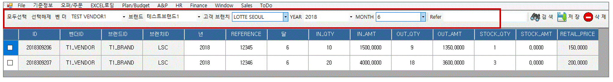

=== 매출실적 EXCEL (텔플릿) ===
특정 벤더인 경우에는 컬럼 매핑을 통해서 매출실적 데이터를 업로드 하는 것이 번거로운 작업이 되는 경우가 있다. 브랜드가 너무 많은 경우, 각 브랜드마다 매출 실적 EXCEL 데이터를 만들고 업로드 하는 것이 비효율적이라고 판단이 되는 경우 템플릿 파일을 활용하여 매출 실적 데이터를 업로드 할 수 있다. 

==== 매출실적 템플릿 파일 ====
매출 실적 데이터 템플릿 파일은 상 프로그램 설치 경로 아래 template\sales_upload_template.xlsx 이다. 

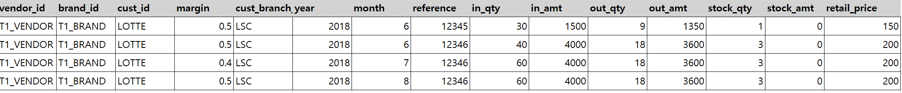

위의 파일을 열어보면 제품 정보를 업로드 하기 위한 컬럼 정보를 확인할 수 있다. 아래는 해당 컬럼 정보에 대한 설명이다.

.매출 데이터 템플릿 컬럼 설명
|===
|컬럼명 | 컬럼 설명 | 필수 여부 | 비고 
|vendor_id | 벤더 아이디 | O | 
|brand_id  | 해당 상품의 브랜드 아이디 | O | 
|cust_id | 고객 아이디 | O | 
|margin | 해당 상품 마진율 | X | 값이 없는 경우 마스터 데이터 값 적용 
|cust_branch_id | 고객 지점 아이디 | O | 
| year | 매출 년도 | O | 
| month | 매출 월 | O |
|reference | 상품 reference 번호 | O |
|retail_price |판매가격 | X | 값이 없는 경우 마스터 데이터 값 적용함
|in_qty	| 입고량 |  X |
|in_amt	| 입고금액 |X |
|out_qty	 | 판매량 |X |
|out_amt	 | 판매금액 |X |
|stock_qty  |재고량 |X |
|stock_amt	| 재고금액|X |
|
|===

IMPORTANT: 템플릿  파일을 이용하면, 다수의 벤더, 브랜드 의 매출 데이터를 한번에 업로드 할 수 있는 장점이 있다. 

TIP: 매출 데이터를 업로드 하는 과정에서 기존 데이터가  있으면 현재 Excel 에 있는 데이터를 기준으로 매출 데이터를 업데이트 하게 되고, 존재하지 않으면 새로운 매출 데이터를 생성한다.

==== 매출 데이터 업로드 ====
매출 데이터 템플릿 파일에 매출 정보를 모두 입력한 후에는 시스템을 이용하여 해당 정보를 시스템에 업로드 하여야 한다. 

==== 매출 실적 Excel 선택 ====
메뉴의 [EXCEL 로딩] -> [매출 실적 EXCEL (템플릿 사용) ] 을 클릭한다.  실행된 화면에서, 데이터 종류가  '매출 데이터 업로드 (템플릿) ' 로 되어 있는지 확인한다.

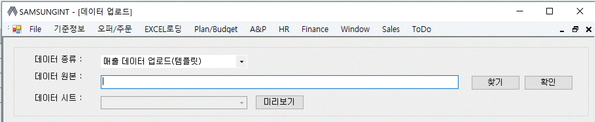

. 찾기: 매출 정보 Excel template 파일의 위치를 지정한다.
. 확인: template 파일 위치를 지정했으면 [확인] 버튼을 눌러서 Excel 파일 정보를 읽어 온다. 
. 데이터 시트 지정 : [확인] 버튼을 누르면 [데이터 시트 ] 콤보 박스에 선택한 Excel 파일의 시트명이 보이게 된다. 해당 시트 중에서 업로드할 거래 기본 정보가 존재하는 시트명을 선택한다.
. 미리보기 : Excel 시트를 선택한 후에는 [미리보기] 버튼을 클릭하여, 업로드할 매출 정보 데이터를 확인한다.

==== 매출 실적 데이터 미리보기 ====
화면의 [미리보기] 를 클릭하여 현재 입력된 Excel 의 매출 데이터를 확인한다. 매출 데이터가 어떠한 형식으로 입력되어 있는지 확인한다.

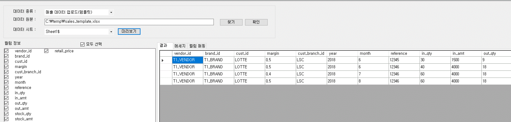

===== 데이터 검증 =====
매출 데이터는 업로드 하기 전에 데이터 검증 과정을 거치게 된다. 화면 하단의 [데이터 검증] 을 클릭하여 데이터 검증 과정을 수행한다. 이 과정에서 검증하는 항목은 아래와 같다.

.상품 데이터 검증 항목
|===
|검증 항목 | 설명
|Vendor 유효성 | 입력한 벤더 ID가 존재하는지 확인
|Brand 유효성  | 입력한 브랜드가 존재하는지 확인
|Customer 유효성 | 입력한 고객 ID 가 존재하는지 확인
|Customer Branch 유효성 | 입력한 고객 지점 ID 가 존재하는지 확인
|상품 유효성 | 해당 제품의 reference 가 존재하는지 확인
|===

검증 과정에서 문제가 없는 경우 데이터 검증에 성공했다는 메세지를 확인할 수 있다.

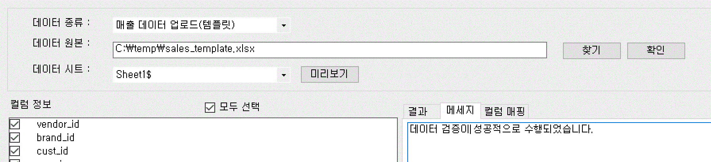

===== 데이터 업로드 =====
검증 과정을 마쳤으면 하단의 [업로드] 버튼을 클릭하여, 데이터를 업로드한다.  성공적으로 업로드 되었으면 아래와 같은 메세지를 확인할 수 있다.

==== 매출 데이터 확인 ====
업로드한 매출 데이터를 확인하기 위해서 프로그램의 [Sales]->[실적정보 조회/수정] 메뉴를 클릭한다. 실행한 화면에서 벤더 정보, 브랜드 정보, 고객 지점 정보, 년/ 월 정보를 설정하고 [검색] 버튼을 클릭한다. 조회된 데이터가 올바른지 확인한다.

