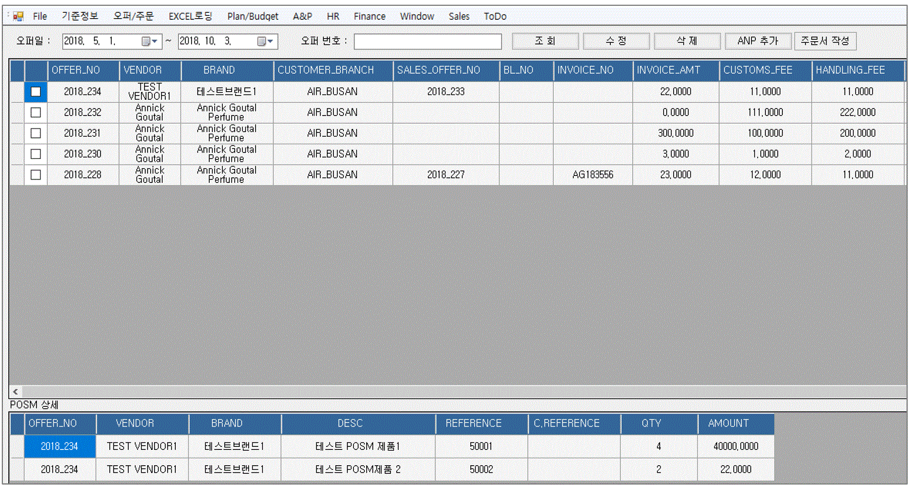

:sectnums:
== 오퍼 ==
본 섹션에서는 고객 상품으로 등록된 브랜드 제품을 오퍼하는 방법에 대하여 설명하겠다.

=== 오퍼 등록 ===
신규 오퍼를 등록하려면 메인 화면에서 [오퍼/주문] -> [오퍼 등록] 메뉴를 클릭한다.

(중요) 오퍼를 하기 위해서는 우선 제품을 검색해야 한다

image::images/offer_add_1.gif[]

. 벤더 선택 : 검색하고자 하는 벤더를 선택한다.
. 브랜드 선택 : 검색하고자 하는 브랜드를 선택한다.
. 고객 선택 : 고객을 선택한다.
. 상품 종류 선택 : 상품 종류 (Saleable/Posm) 를 선택한다.
. 지점 선택 : 고객 지점을 선택한다.
. 건수 : 검색하고자 하는 제품 건수를 입력한다.
. 조회 : 선택한 조건에 맞는 제품을 선택한다.
. 장바구니 : 선택한 제품을 오퍼 장바구니에 담는다.
. 고객 상품 등록 : 선택한 제품을 고객 상품으로 등록한다.
. 기준월 : 오퍼 기준월을 선택한다. 예를 들어 2018년 8월을 선택한 경우, 5월, 6월 7월 삼개월 동안의 매출 정보를 제공한다.
. 예산 총액: 오퍼 예산액을 입력한다.
. 고객 지점 정보 : 선택한 고객 지점 정보를 확인할 수 있다.

제품을 검색하기 위해서는 상단의 메뉴를 사용하여 검색하고자 하는 벤더, 브랜드, 고객, 그리고 제품 종류를 선택한다.

==== 고객 지점 선택 및 추가 상품 선택 ====
 [지점 선택] 버튼을 클릭하면, 선택한 고객에 속한 고객 지점 리스트를 확인할 수 있다.

하나의 고객 지점에 대하여 오퍼를 내는 것이 기본 업무 흐름이지만, 어떠한 경우에는 여러 고객 지점에 공급할 제품을 오퍼를 내야 되는 경우가 있다. 이러한 경우, 표시된 고객 지점 리스트에서 여러 고객 지점을 선택하고, 아래 화면에서 대표 고객 지점을 설정해준다. 이렇게 하면 대표 고객 지점 이름으로 여러 고객 지점에 공급할 제품을 오퍼할 수 있다.

대표지점의 의미: 실질적으로 여러 지점으로 분배되나 명목상으로 하나의 지점으로 주문될 때의 지점 명 

또한, 특정 오퍼인 경우 특정 고객 지점에게만 공급할 제품을 개별적으로 설정해야 되는 경우가 있다. 이러한 경우에는 [추가 옵션 상품] 란에서 해당 고객 지점을 선택하고, 제품을 검색한다. 검색된 제품이 하단의 좌측 화면에 표시가 되고, [>] 버튼을 눌러서 추가로 주문할 제품을 선택할 수 있다.

[확인] 버튼을 눌러서 고객 지점 및 추가 상품에 대한 조건 설정을 완료한다.

==== 고객 상품 등록 ====
image::images/offer3.gif[]

검색 조건 설정을 마쳤으면, [조회] 버튼을 눌러서 해당 검색 조건에 맞는 제품을 검색한다. 검색 결과를 보면, 'CUST_ID' 컬럼이 비어 있고 배경 색깔이 노란색으로 되어 있는 제품을 볼 수 있다. 검색된 제품 중에 선택한 고객의 취급 상품으로 등록되어 있지 않은 경우 이렇게 표시되어 진다. 고객 상품으로 등록이 안된 제품은 오퍼할 수 없기 때문에 이러한 경우에는 해당 제품을 '고객 상품' 으로 등록해야 한다. '고객 상품' 으로 등록할 수 있는 방법은 2가지이다.

[EXCEL 로딩] -> [브랜드별 입점정보 EXCEL] 기능 사용 ::
앞장에서 설명했던 기능이다. 엑셀 파일에 브랜드별 입점 정보 데이터를 입력하여 업로드 한다.

현재 화면의 [고객 상품 등록] 기능 활용 ::
현재 제품 검색 화면에서 고객 상품으로 등록하고자 하는 제품을 선택하고, 상단 메뉴의 [고객 상품 등록] 버튼을 클릭한다.

image::images/offer4.gif[800,600]

고객이 부여한 제품 reference 번호가 있는 경우 입력한다. 없는 경우 그냥 제품의 reference 번호를 입력한다. [확인] 버튼을 눌러 고객 상품으로 등록한다.

'고객 상품' 으로 등록이 되면 'CUST_ID' 컬럼에 금방 등록한 고객 ID 값이 보여지고, 배경 색깔도 하얀 색으로 변한다.

==== 오퍼 수량 계산 ====
image::images/offer6.gif[400,200]

[오퍼 등록] 화면의 우측 메뉴를 보면 예산 정보 및 안전 재고율을 설정할 서 있는  화면이 있댜.

. 예산 총액 : 오퍼에 사용할 예산 총액을 기입한다. 예산 총액이 초과할 경우 프로그램에서 경고 기능이 동작한다.
. 주문 금액 : 프로그램에서 자동으로 계산한다.
. 안전재고 : 안전재고율을 설정한다.
. 안전재고 일괄적용 : 오퍼할 제품에 대하여 위에서 설정한 안전 재고율을 일괄 적용한다.
. 자동계산 : 설정한 안전 재고율과 3개월간의 판매량 및 기말 재고를 기반으로 오퍼할 수량을 자동으로 계산한다.

TIP: 안전 재고율은 일괄 적용이 가능하며, 검색된 제품 리스트에서 '안전 재고' 컬럼값을 직접 수정함으로써 개별 설정할 수도 있다.

TIP: 최근 3개월의 매출 데이터가 존재하지 않는 경우, 자동 계산은 동작하지 않는다. 이러한 경우, 직접 주문 수량을 입력해야 한다. 직접 주문 수량을 입력하기 위하여, 원하는 제품의 주문 수량란을 선택하고  주문 수량을 입력한다.

==== 오퍼 장바구니 넣기 ====
주문할 제품을 조회하고 주문 수량을 입력한 후에는 [장바구니] 버튼을 눌러서 선택한 제품을 오퍼 장바구니에 넣는다. '오퍼 장바구니' 는 오퍼할 제품을 임시로 저장하는 공간이며, 장바구니에 있는 제품들을 선택해서 최종 오퍼를 확정할 수 있다.

==== POSM 상품 오퍼하기 ====
[장바구니] 버튼을 누르면 위와 같은 메세지를 볼 수 있다. 현재 장바구니를 확인할 수 있고, 계속해서 posm 오퍼를 진행할 수도 있다. [POSM 확인] 버튼을 누르면, 현재 벤더에서 공급하는 posm 제품을 조회한 화면을 확인할 수 있다.

TIP: 위 선택창에서 [POSM 확인] 버튼을 선택하지 않고, [장바구니 확인] 버튼을 클릭해서 장바구니를 확인한 후에도 [오퍼/주문] → [오퍼 등록] 메뉴를 통해서 POSM 제품을 오퍼할 수 있다.

위 화면을 보면, 상품 종류가 'POSM' 으로 선택되어 있는 것을 볼 수 있으며, 선택한 벤더의 POSM 제품이 조회된 것을 확인할 수 있다.

TIP: 'Saleable 상품' 은 검색된 제품이 고객 상품으로 등록이 되어 있지 않으면, 오퍼할 수 없지만, 'POSM 상품' 은 이에 관계 없이 오퍼를 낼 수 있다. 'Saleable 상품' 은 CUST_ID 컬럼이 공백이면, 노란색 배경으로 표시되고 오퍼할 수 없었지만, 위 화면에서는 그러한 제약 조건이 없음을 확인할 수 있다.

'POSM 상품' 은 매출 데이터가 존재하지 않으므로, 수동으로 발주 수량을 입력한다. 입력한 후에 [장바구니] 버튼을 눌러 장바구니에 담긴 상품들을 확인한다.

=== 오퍼 발행 확정 ===
오퍼 장바구니 화면에서는 오퍼를 하기 위해서 등록한 상품 정보를 확인할 수 있다. 오퍼 장바구니 화면은 오퍼 상품을 등록한 후 [장바구니 확인] 버튼을 눌러서 확인할 수 있고, 또는 메인 메뉴의 [오퍼/주문] -> [오퍼 발행 확정] 메뉴를 통해서도 확인할 수 있다.

. 조회 : 임시 오퍼 상품을 조회한다.
. 기준월 : 임시 오퍼 상품을 조회하기 위한 기간을 설정한다.
. 오퍼하기 : 선택한 상품을 오퍼한다.
. 삭제 : 선택한 상품을 삭제한다.

기준월을 선택하고 '조회하기' 버튼을 누르면 오퍼를 하기 위하여 임시로 저장한 상품들을 조회할 수 있다.

상품 정보를 확인했으면, [오퍼하기] 버튼을 눌러서 오퍼를 진행한다. 오퍼를 할 때의 제약사항은 아래와 같다.

. 하나의 오퍼에는 하나의 벤더 제품만 포함되어야 한다.
. 하나의 오퍼에는 하나의 브랜드 제품만 포함되어야 한다.
. 하나의 오퍼에는 하나의 대표고객 지점만 존재해야 합니다.

=== SALEABLE 오퍼 조회 ===
오퍼 장바구니에서 오퍼로 등록하게 되면 상품의 종류(Saleable / POSM ) 에 따라서 개별적으로 오퍼가 발생한다. SALEABLE 오퍼는 메인 메뉴의 [오퍼/주문] -> [SALEABLE 오퍼조회] 에서, POSM 상품 오퍼는 [오퍼/주문] -> [POSM 오퍼조회] 에서 확인할 수 있다.  SALEABLE 상품의 오퍼를 조회하기 위하여 메인 메뉴의 [오퍼/주문] -> [SALEABLE 오퍼조회] 를 클릭한다.

image::images/offer12.gif[]

. 오퍼 상태 : 오퍼 상태를 선택한다.
. 오퍼일 : 검색하려는 오퍼 기간을 선택한다. 설정한 날짜 사이에 등록된 오퍼 정보를 보여준다.
. 조 회 : 해당 검색 조건을 기반으로 오퍼를 조회한다.
. 오퍼 수정 : 선택한 오퍼를 수정할 수 있는 창을 새롭게 연다.
. 주문서 작성 : 해당 오퍼를 기반으로 주문서를 작성한다. 나중에 좀 더 자세히 설명한다.
. ANP 추가 : 해당 오퍼를 ANP 에 추가한다. 나중에 좀 더 자세히 설명한다.
. 오퍼 조회창 : 검색 조건에 해당하는 오퍼 항목이 조회된다.
. 오퍼 디테일창 : 선택한 오퍼에 대한 오퍼 상세 사항을 보여준다.
. 오퍼 상품 정보 : 해당 오퍼에 등록한 상품 정보를 확인할 수 있댜.

==== 오퍼 수정 ====
 오퍼 정보를 수정하려면, 해당 오퍼를 더블클릭하거나 선택 후 [오퍼 수정] 버튼을 클릭한다. 아래와 같은 오퍼 수정창이 열린다.

image::images/offer13.gif[]

오퍼 수정창의 상단에는 오퍼 기본 정보를 수정할 수 있는 기능이 제공된다. 오퍼 기본 정보 수정창에서 수정할 수 있는 오퍼 정보는 'PO 번호' 와 '오퍼 상태' 이다. 나머지 정보들은 나중에 ANP 등록이나 INVOICE 생성 기능을 통해서 자동으로 만들어지는 항목들이기 때문에 수정할 수 없다. 해당 정보를 수정한 후에 [저장 ] 버튼을 클릭해서 변경된 정보를 저장할 수 있다.

===== 오퍼 상세 추가 =====
[오퍼 상세 추가] 버튼을 클릭하면 현재 오퍼에 대한 세부 사항을 추가할 수 있는 창이 열린다.

Customer 송장 번호, 선적수량, 선적가격, O.C Date 등 상세 내용을 기입하고 [확인] 버튼을 눌러서 오퍼 상세 정보를 저장한다. 필요한 만큼 오퍼 상세 정보는 추가할 수 있다. 추가한 상제 정보는 화면의 중간 부분에서 확인할 수 있다.

image::images/offer15.gif[]

==== 관련 파일 추가 ====
오퍼 수정 화면의 하단에는 해당 오퍼과 관련된 첨부 파일을 업로드 할 수 있는 기능이 있다. [파일 업로드] 버튼을 눌러서 첨부하려는 파일을 선택하고 저장할 수 있다. 첨부한 파일은 [파일 다운로드] 메뉴를 통해서 로컬 컴퓨터로 다시 저장할 수 있다.

==== 주문서 작성 ====

주문서 작성 기능은 벤더에게 송부하는 오더폼을 작성하는 기능이다. 다양한 벤더마다 요구하는 오더폼 양식이 모두 다르기 때문에 STA 시스템에서는 벤더에서 제공하는 오더폼 엑셀 양식을 읽어온 후에 읽어온 엑셀 파일에 값을 자동으로 채워 넣은 기능을 제공하고 있다. 

===== 주문서 작성창 열기 =====
오퍼 조회 화면에서 주문서를 작성할 오퍼를 선택하고, 상단의 [주문서 작성] 버튼을 클릭한다. 

image::images/offer16.gif[]

주문서 작성 화면이 실행된다. 

image::images/offer17.gif[]

다양한 기능이 제공되기 때문에 조금 복잡해 보일 수 있다. 한단계씩 따라 가면서 설명하겠다. 우선 벤더에서 제공하는 오더폼이 아래와 같은 양식이라고 가정하겠다. 

우리가 해야 할 일은 위의 엑셀 파일을 읽어와서 [qty],[amount] 항목을 채우는 것이다. 

===== 오더 양식 읽어 오기 =====
주문서 작성창의 [찾기] 버튼을 클릭하여, 벤더에서 보내온 주문서 양식 엑셀 파일을 선택한다. 파일을 선택하면 하단의 'Sheet 명' 에서 해당 엑셀 파일에 있는 sheet 를 선택할 수 있다. 주문서 내용이 있는 sheet 명을 선택하고 [미리보기] 버튼을 클릭한다.

===== 오더 양식 설정하기 =====

미리보기 화면을 유심히 살펴보면, 위의 실제 엑셀 파일의 내용이 미리보기 창에 어떻게 보이는지 알 수 있다. 우리가 원하는 것은 엑셀에 있는  'product no', 'product name' , 'desc', 'qty', 'amount', 'price' 들이 이 엑셀 파일에서 컬럼으로 동작하는 것이다. 그러기 위해서 '미리보기' 위에 있는 '시작 컬럼', '시작 라인' 값을 조절해 주는 것이 필요하다. 

image::images/offer20.gif[]

위의 그림을 보면 원본 엑셀 파일에서 우리가 원하는 데이터는 '3' 번재 라인, 'B' 컬럼에서 시작하는 것을 알 수 있다. 종료컬럼과 종료 라인은 특별히 설정할 필요는 없다. 프로그램에서 시작 컬럼을 'B', 시작 라인을 '3' 으로 설정하고 다시 '미리보기' 버튼을 클릭한다. 

우리가 원하는 모양으로 미리보기 가 보이는 것을 확인할 수 있다. 

image::images/offer22.gif[]

이제는 오더폼의 qty, amount 컬럼을 채우기 위한 컬럼 매핑 작업을 해야 한다. 화면의 중간에 보면 Qty, Amount, Refer 컬럼과 대응하는 엑셀 파일의 컬럼명을 설정하는 기능이 있다. 

. Qty : 주문 수량 -> 원본 엑셀의 qty 컬럼과 매핑
. Amount : 주문 금액 -> 원본 엑셀의 amount 컬럼과 매핑
. Refer : 상품의 reference 번호 -> 원본 엑셀의 product no 와 매핑

TIP: Refer 컬럼은 해당 상품을 인식할 수 있는 고유 번호 컬럼이다. 이 컬럼의 값을 기준으로 해서 Qty, Amount 값이 채워지게 된다. 

만일 벤더의 오더폼이 Qty 값만 입력하면 자동으로 주문금액 컬럼이 채워지는 구조로 되어 있다면, 아래의 'Amount 항목은 계산되어지는 값입니다.' 를 체크해 준다. 

===== 데이터 검증 =====
주문서를 작성하기 전에 데이터 유효성 검증을 수행해야 할 필요가 있을 때가 있다. 이러한 경우, 프로그램 하단의 유효성 검사 기능을 통해서 데이터 유효성 검사를 할 수가 있다. 

image::images/offer23.gif[]

데이터 검증은 '상품 검증' 과 '가격 검증' 두가지로 나뉘어 진다. '가격 검증'은 STA 시스템에 등록된 상품의 가격과 주문서에 가격 정보가 존재하는 경우 가격 정보가 일치하는지 검증하는 과정이다. 주문서에서 가격 정보가 존재하는 컬럼을 선택하고 '가격 검증' 버튼을 클릭하면 검증 과정을 거치게 된다. 검증할 필요가 없는 경우 체크박스를 해제한다. 

두번째 '상품 검증' 은 시스템에 등록된 상품이 주문서에 존재하는지 검증하는 과정이다. 검증할 필요가 없는 경우 체크박스를 해제한다. 

===== 주문서 작성 =====
데이터 검증 과정까지 성공리에 마무리 되었다면, 하단의 [주문서 작성] 버튼을 눌러서 주문서를 작성한다. 주문서는 자동으로 STA 시스템의 클라우드 서버에 저장되고 로컬에도 다른 이름으로 저장된다. 

image::images/offer24.gif[600,400]

최종적으로 작성된 주문서는 아래와 같다. 

===== ANP 추가 ===== 
선택한 오퍼를 ANP 에 추가하는 기능이다. ANP 에 추가하고자 하는 오퍼를 선택하고, 상단의 [ANP 등록] 버튼을 누른다.

image::images/offer26.gif[]

IMPORTANT: 여러개의 오퍼를 ANP 에 등록하기 위한 제약사항이 있다. 

. 선택한 오퍼들은  단일 브랜드에 대한 오퍼이어야 한다.
. 선택한 오퍼들은 하나의 고객에 대한 오퍼이어야 한다.
. 오퍼 상세에 있는 ** Customer Invoice Date ** 가 한달 이내인 오퍼만 가능하다.

ANP 에 대한 기능은 ANP 섹션에서 설명하다.

=== POSM 오퍼 조회 ===
오퍼 장바구니에서 오퍼로 등록하게 되면 상품의 종류(Saleable / POSM ) 에 따라서 개별적으로 오퍼가 발생한다.  POSM  오퍼는 [오퍼/주문] -> [POSM 오퍼조회] 에서 확인할 수 있다.  POSM 오퍼를 조회하기 위하여 메인 메뉴의 [오퍼/주문] -> [POSM 오퍼조회] 를 클릭한다.

. 오퍼일 : 검색하려는 오퍼 기간을 선택한다. 설정한 날짜 사이에 등록된 오퍼 정보를 보여준다.
. 조 회 : 해당 검색 조건을 기반으로 오퍼를 조회한다.
. 수정 : 선택한 오퍼를 수정할 수 있는 창을 새롭게 연다.
. 주문서 작성 : 해당 오퍼를 기반으로 주문서를 작성한다. 나중에 좀 더 자세히 설명한다.
. ANP 추가 : 해당 오퍼를 ANP 에 추가한다. 나중에 좀 더 자세히 설명한다.
. 오퍼 조회창 : 검색 조건에 해당하는 오퍼 항목이 조회된다.
. POSM 상세 : 해당 오퍼에 등록한 POSM 상품 정보를 확인할 수 있댜.

==== 오퍼 수정 ====
 오퍼 정보를 수정하려면, 해당 오퍼를 더블클릭하거나 선택 후 [오퍼 수정] 버튼을 클릭한다. 아래와 같은 오퍼 수정창이 열린다.

image::images/posm_offer2.gif[]

오퍼 수정창의 상단에는 오퍼 기본 정보를 수정할 수 있는 기능이 제공된다. 오퍼 기본 정보 수정창에서 수정할 수 있는 오퍼 정보는 'BL 번호', POSM Invoice 번호, Customes Fee, Handling Fee 이다. 나머지 정보들은 나중에 ANP 등록이나 INVOICE 생성 기능을 통해서 자동으로 만들어지는 항목들이기 때문에 수정할 수 없다. 해당 정보를 수정한 후에 [저장 ] 버튼을 클릭해서 변경된 정보를 저장할 수 있다.

==== 주문서 작성 ====

주문서 작성 기능은 벤더에게 송부하는 오더폼을 작성하는 기능이다. 다양한 벤더마다 요구하는 오더폼 양식이 모두 다르기 때문에 STA 시스템에서는 벤더에서 제공하는 오더폼 엑셀 양식을 읽어온 후에 읽어온 엑셀 파일에 값을 자동으로 채워 넣은 기능을 제공하고 있다. 

===== 주문서 작성창 열기 =====
오퍼 조회 화면에서 주문서를 작성할 오퍼를 선택하고, 상단의 [주문서 작성] 버튼을 클릭한다. 

image::images/offer16.gif[]

주문서 작성 화면이 실행된다. 

image::images/offer17.gif[]

다양한 기능이 제공되기 때문에 조금 복잡해 보일 수 있다. 한단계씩 따라 가면서 설명하겠다. 우선 벤더에서 제공하는 오더폼이 아래와 같은 양식이라고 가정하겠다. 

우리가 해야 할 일은 위의 엑셀 파일을 읽어와서 [qty],[amount] 항목을 채우는 것이다. 

===== 오더 양식 읽어 오기 =====
주문서 작성창의 [찾기] 버튼을 클릭하여, 벤더에서 보내온 주문서 양식 엑셀 파일을 선택한다. 파일을 선택하면 하단의 'Sheet 명' 에서 해당 엑셀 파일에 있는 sheet 를 선택할 수 있다. 주문서 내용이 있는 sheet 명을 선택하고 [미리보기] 버튼을 클릭한다.

===== 오더 양식 설정하기 =====

미리보기 화면을 유심히 살펴보면, 위의 실제 엑셀 파일의 내용이 미리보기 창에 어떻게 보이는지 알 수 있다. 우리가 원하는 것은 엑셀에 있는  'product no', 'product name' , 'desc', 'qty', 'amount', 'price' 들이 이 엑셀 파일에서 컬럼으로 동작하는 것이다. 그러기 위해서 '미리보기' 위에 있는 '시작 컬럼', '시작 라인' 값을 조절해 주는 것이 필요하다. 

image::images/offer20.gif[]

위의 그림을 보면 원본 엑셀 파일에서 우리가 원하는 데이터는 '3' 번재 라인, 'B' 컬럼에서 시작하는 것을 알 수 있다. 종료컬럼과 종료 라인은 특별히 설정할 필요는 없다. 프로그램에서 시작 컬럼을 'B', 시작 라인을 '3' 으로 설정하고 다시 '미리보기' 버튼을 클릭한다. 

우리가 원하는 모양으로 미리보기 가 보이는 것을 확인할 수 있다. 

image::images/offer22.gif[]

이제는 오더폼의 qty, amount 컬럼을 채우기 위한 컬럼 매핑 작업을 해야 한다. 화면의 중간에 보면 Qty, Amount, Refer 컬럼과 대응하는 엑셀 파일의 컬럼명을 설정하는 기능이 있다. 

. Qty : 주문 수량 -> 원본 엑셀의 qty 컬럼과 매핑
. Amount : 주문 금액 -> 원본 엑셀의 amount 컬럼과 매핑
. Refer : 상품의 reference 번호 -> 원본 엑셀의 product no 와 매핑

TIP: Refer 컬럼은 해당 상품을 인식할 수 있는 고유 번호 컬럼이다. 이 컬럼의 값을 기준으로 해서 Qty, Amount 값이 채워지게 된다. 

만일 벤더의 오더폼이 Qty 값만 입력하면 자동으로 주문금액 컬럼이 채워지는 구조로 되어 있다면, 아래의 'Amount 항목은 계산되어지는 값입니다.' 를 체크해 준다. 

===== 데이터 검증 =====
주문서를 작성하기 전에 데이터 유효성 검증을 수행해야 할 필요가 있을 때가 있다. 이러한 경우, 프로그램 하단의 유효성 검사 기능을 통해서 데이터 유효성 검사를 할 수가 있다. 

image::images/offer23.gif[]

데이터 검증은 '상품 검증' 과 '가격 검증' 두가지로 나뉘어 진다. '가격 검증'은 STA 시스템에 등록된 상품의 가격과 주문서에 가격 정보가 존재하는 경우 가격 정보가 일치하는지 검증하는 과정이다. 주문서에서 가격 정보가 존재하는 컬럼을 선택하고 '가격 검증' 버튼을 클릭하면 검증 과정을 거치게 된다. 검증할 필요가 없는 경우 체크박스를 해제한다. 

두번째 '상품 검증' 은 시스템에 등록된 상품이 주문서에 존재하는지 검증하는 과정이다. 검증할 필요가 없는 경우 체크박스를 해제한다. 

===== 주문서 작성 =====
데이터 검증 과정까지 성공리에 마무리 되었다면, 하단의 [주문서 작성] 버튼을 눌러서 주문서를 작성한다. 주문서는 자동으로 STA 시스템의 클라우드 서버에 저장되고 로컬에도 다른 이름으로 저장된다. 

image::images/offer24.gif[600,400]

최종적으로 작성된 주문서는 아래와 같다. 

===== ANP 추가 ===== 
선택한 오퍼를 ANP 에 추가하는 기능이다. ANP 에 추가하고자 하는 오퍼를 선택하고, 상단의 [ANP 등록] 버튼을 누른다.