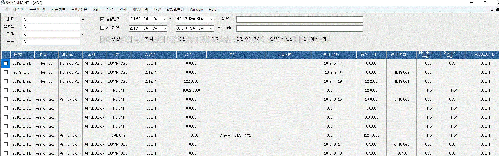

:sectnums:

== ANP ==
[ANP] 메뉴는 ANP 를 생성/조회/삭제/수정 하는 기능을 제공합니다. 

벤더::
조회하고자 하는 벤더를 선택합니다. 
브랜드::
조회하고자 하는 브랜드를 선택합니다. 
고객::
조회하고자 하는 고객을 선택합니다. 
구분::
조회하고자 하는 ANP 상태를 선택합니다. 
생성날짜::
ANP 를 생성한 날짜를 기준으로 ANP 를 조회합니다.
지급날짜::
금액을 지급한 날짜를 기준으로 ANP 를 조회합니다. 

=== ANP 생성 ===

ANP 메인 화면에서 '생성' 버튼을 클릭합니다. 

image::images/add_anp.gif[]

벤더:: 벤더를 선택합니다. 
고객:: 고객을 선택합니다. 
구분:: ANP 카테고리를 선택합니다. 
등록일:: 등록일을 설정합니다.
지결일:: 지급결제일을 선택합니다.
Amount:: 금액을 설정합니다.  금액을 설정하면 현재 통화 정보에 따라서 인보이스 금액이 자동으로 설정됩니다. 인보이스 금액은 수동으로 수정할 수도 있습니다. 
Sales Currency : 통화를 설정합니다. 

'저장' 버튼을 누르면 새로운 ANP 가 생성이 됩니다. 

IMPORTANT: 인보이스 관련 정보들은 ANP 메인 화면에서 '인보이스 생성' 버튼을 클릭했을 때 자동으로 등록되는 정보들입니다. 

=== ANP 조회 ===

ANP 메인 화면에서 '조회' 버튼을 클릭합니다. 선택한 검색 조건을 기준으로 ANP 를 조회합니다. 

=== ANP 수정 ===

수정할 ANP 항목을 더블클릭하거나, ANP 를 선택하고 '수정' 버튼을 클릭합니다. 'ANP 생성' 화면과 동일한 화면에서 해당 ANP 정보를 수정할 수 있습니다. 

=== ANP 삭제 ===
삭제할 ANP 들 선택하고 '삭제' 버튼을 클릭합니다. 

=== 연관 오퍼 조회 ===
ANP 카테고리가 'COMMISSION' 인 경우, 관련된 Offer 리스트를 조회할 수 있습니다. 

=== 인보이스 생성 ===
IMPORTANT: 현재 버전에서는 ANP 카테고리가 'COMMISSION' 인 경우에만 인보이스 생성 기능을 사용할 수 있습니다. 다음 버전에서는 모든 항목에 대한 인보이스 생성 기능을 제공할 예정입니다. 

'인보이스 생성' 버튼을 누르면, 인보이스 생성을 위한 상세 데이터를 확인할 수 있습니다. 

image::images/preview_invoice.gif[]

인보이스를 생성하려면, '인보이스 미리보기' 버튼을 클릭합니다. 

image::images/preview_invoice2.gif[]

미리보기 화면에서 상단의 'invoice 생성' 버튼을 클릭하면 인보이스를 생성하고 저장할 수 있습니다. 

=== 인보이스 보기 ===
선택한 ANP 항목과 관련된 인보이스를 확인할 수 있습니다. 

