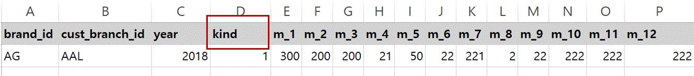
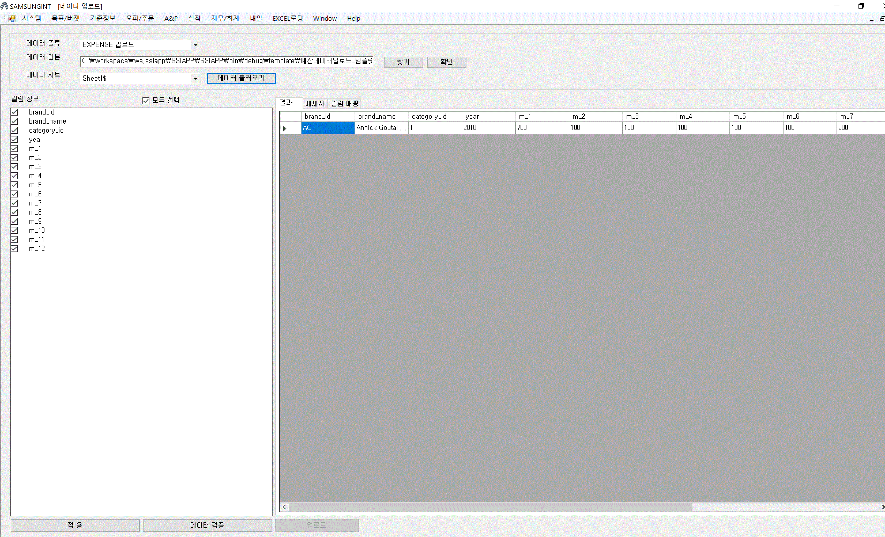

:sectnums:

== 목표/버젯 ==
 [목표/버젯 ] 메뉴는 Sell in, Sell out 에 대한 목표를 설정하고 조회하는 기능과, 사용한 경비에 대한 예산을 수립하는 기능을 제공한다. 

=== 목표/버젯 조회 ===

메인 메뉴에서 [목표/버젯] -> [목표/버젯 조회] 메뉴를 클릭하며, 목표/버젯 조회 화면을 실행한다.

image::images/budget_main.gif[]

종류::
Budget/Expnese 중 선택할 수 있다. 
- Budget : Sell in/ Sell out 에 대한 목표를 수립한다. 
- Expnese :  사용할 경비에 대한 예산을 수립한다. 

브랜드::
조회할 브랜드를 선택한다. 
지점::
조회할 고객 지점을 선택한다. 
년::
조회할 year 를 선택한다.
조회::
선택한 조건을 기준으로 데이터를 조회한다. 
데이터 업로드::
목표 데이터를 업로드 한다. 
삭제::
선택한 데이터를 삭제한다. 
내려받기::
조회한 데이터를 엑셀로 내려받는다. 
리포트::
조회한 조건을 기준으로 report 를 생성한다. 

=== 목표 데이터 엑셀 업로드 ===
메인 메뉴에서 [목표/버젯] -> [목표/버젯 엑셀업로드] 메뉴를 클릭하며, 목표 데이터를 업로드 한다. 목표 데이터는 [프로그램 폴더] -> [template] 폴더에 '목표데이터업로드_템플릿.xlxs' 파일을 이용하여 업로드 할 수 있다.  

엑셀 파일을 열어 보면,  브랜드 아이디/고객지점 아이디/년도 정도/월별 금액 을 입력할 수 있게 되어 있다. 

IMPORTANT: [kind] 란 컬럼을 볼 수 있는데, 입력하는 정보가 SellOut 인 경우는 1, SellIn 인 경우는 2 를 입력해야 한다. [kind_str] 컬럼은 비워둬도 된다. 

목표 데이터를 업로드 하기 위하여 [데이터 업로드] 버튼을 클릭한다. 

image::images/budget_upload.gif[]

데이터 종류::
기본으로 'BUDGET 업로드' 로 선택되어 있다. 

데이터 원본::
작성한 엑셀 파일을 선택하고 [확인] 을 클릭한다. 

데이터시트::
데이터가 포함된 엑셀 시트를 선택하고, [미리보기] 버튼을 클릭하여 데이터를 확인한다. 

데이터 검증::
[데이터 검증] 버튼을 클릭하여, 입력한 데이터의 유효성을 검증한다. 기본적으로 브랜드 아이디와 고객 지점 아이디의 유효성을 검증한다.

업로드::
데이터 검증에서 아무런 문제가 없으면 업로드 버튼을 눌러서 데이터을 업로드 한다.

=== 경비 예산 데이터 업로드 ===
메인 메뉴에서 [목표/버젯] -> [목표/버젯 엑셀업로드] 메뉴를 클릭하며, 예산 데이터를 업로드 한다. 목표 데이터는 [프로그램 폴더] -> [template] 폴더 밑의  '예산데이터업로드_템플릿.xlxs' 파일을 이용하여 업로드 할 수 있다.  

image::images/expense_upload_excel.gif[]

엑셀 파일을 열어보면 category_id 란 컬럼을 볼 수 있다. 해당 컬럼은 예산 카테고리를 설정하는 컬럼인데 해당 코드표는 아래와 같다. 

.예산 범주
|===
|값|범주 | 컬럼 설명 
|1|BA Salary | BA Salary 에 소요되는 비용
|2|HQ Salary | HQ Salary 에 소요되는 비용
|3|ADVERTISEMENT | 광고에 소요되는 비용 
|4|CAPEX | CAPEX 에 소요되는 비용
|5|PROMOTION | PROMOTION 에 사용되는 비용 
|6|SALES SUPPORT | SALES SUPPORT 에 소요되는 비용
|7|REBATE | REBATE 에 소요되는 비용
|8|OTHERS | 기타 비용
|===

데이터 종류::
'EXPENSE 업로드' 로 선택한다. 

데이터 원본::
작성한 엑셀 파일을 선택하고 [확인] 을 클릭한다. 

데이터시트::
데이터가 포함된 엑셀 시트를 선택하고, [미리보기] 버튼을 클릭하여 데이터를 확인한다. 

데이터 검증::
[데이터 검증] 버튼을 클릭하여, 입력한 데이터의 유효성을 검증한다. 기본적으로 브랜드 아이디와 고객 지점 아이디의 유효성을 검증한다.

업로드::
데이터 검증에서 아무런 문제가 없으면 업로드 버튼을 눌러서 데이터을 업로드 한다.

