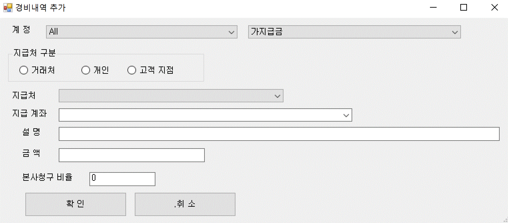
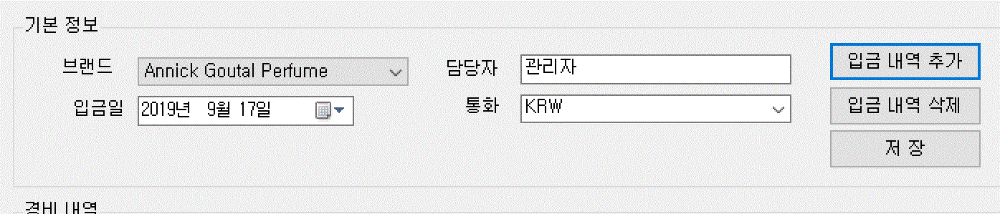
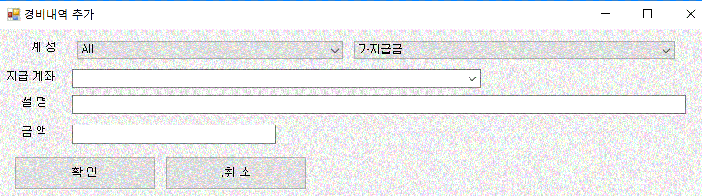
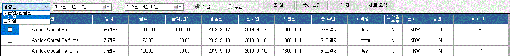
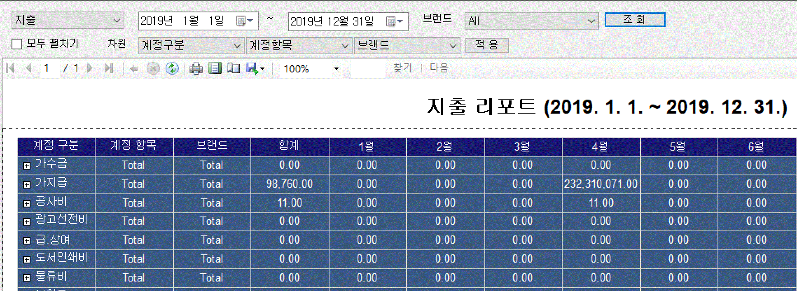

:sectnums:

== 재무회계 ==
재무 회계 메뉴에 대해서 설명한다. 

=== 지출결의 생성 ===

지출 결의를 생성할 수 있는 기능이다. 

image::images/add_output1.gif[]

브랜드:: 지출 결의를 생성할 브랜드를 지정한다. 
담당자:: 현재 로그인한 사용자의 이름이 기본으로 설정된다. 
거래처명:: 거래처명을 자유롭게 입력할 수 있다. 
청구일:: 청구일을 설정한다. 
납기일:: 납기일을 설정한다. 
최종 지출일 :: 실제 지출일을 설정한다. 
거래방법 :: 거래방법을 지정한다. 
본사청구:: 본사청구 필요 유무를 설정한다. 
ANP 구분 :: ANP 카테고리를 설정한다. 
통화:: 지출 통화를 설정한다.
환율:: 통화를 선택하면 자동으로 환율이 변경이 된다. 여기서 직접 수정할 수도 있다. 

==== 경비내역 추가 ====
지출결의 생성 화면에서 [경비내역 추가] 버튼을 클릭하면 경비 내역을 추가할 수 있다. 

계정:: 회계 계정 코드를 선택한다. 서브 카테고리도 선택한다. 
지급처 구분:: 지급처를 거래처/개인/고객지점 중에 선택한다. 
지급처:: 지급처를 선택한다.  존재하지 않는 거래처는 [기준정보] -> [기타 거래처 정보] 를 통하여 추가할 수 있다.
지급계좌:: 지급 계좌 번호를 선택하거나, 직접 입력한다. 
설명:: 해당 지급에 대한 설명을 추가한다. 
금액:: 지급 금액을 명시한다.
본사청구 비율:: 본사 청구가 필요한 경우, 본사 청구 비율을 설정한다.

[확인] 버튼을 눌러 메인 창으로 돌아간다. [저장] 버튼을 눌러 추가한 경비 내역을 저장한다. 

==== 경비내역 삭제 ====
삭제할 경비 내역을 선택한다. [경비 내역 삭제] 버튼을 눌러서 해당 경비 내역을 삭제한다. 영구히 저장하려면 [저장] 버튼을 클릭한다. 

==== 지출결의서 생성 ====
현재 설정된 항목을 기준으로 지출 결의서를 생성한다. 

image::images/add_output3.gif[]

지출 결의서 보기 화면에서 내용을 확인한 후 [저장하기] 버튼을 눌러서 지출결의서를 저장한다. 

==== 지출 결의서 보기 ====
해당 경비내역과 연관된 지출 결의서를 확인한다. 

==== 인보이스 생성 ====
해당 경비 내역이 '본사청구' 인 경우 해당 인보이스를 생성한다. 

=== 입금 정보 생성 ===
입금 정보를 생성에 대한 기능을 제공한다. 

브랜드:: 해당 브랜드를 선택한다. 
담당자:: 담당자를 설정한다. 
입금일:: 입금일을 설정한다.
통화:: 입금 통화를 설정한다. 

==== 입금 내역 추가 ====
입금 내역을 추가할 수 있다. 

계정:: 계정 과목 및 하위 카테고리를 설정한다. 
지급계좌:: 지급 계좌를 입력한다. 
설명:: 입금 내역에 대한 설명을 추가한다. 
금액:: 금액을 입력한다. 

[확인]버튼을 눌러서 해당 입금 내역을 추가한다. 추가할 항목이 존재하면 위의 과정을 반복한다. 최종적으로 저장하려면 [저장] 버튼을 클릭한다. 

==== 입금 내역 삭제 ====
삭제할 입금 내역을 선택하고, [입금내역 삭제] 버튼을 클릭한다. 최종적으로 저장하려면 [저장] 버튼을 클릭한다. 

=== 지출/입금 조회 ===
생성한 지출내역, 입금 내역을 조회한다. 

구분:: 생성일, 지급일/입금일, 납기일 중 하나를 선택한다. 
날짜:: 검색할 날짜 범위를 설정한다. 
지급/입금 구분 :: 지급/수입 중 하나를 선택한다.

검색 조건을 설정하고 [조회] 버튼을 눌러서 경비 내역을 조회한다. 

상세보기:: 해당 경비내역을 선택하고, [상세보기] 버튼을 클릭하면, 해당 경비의 상세 내역을 확인할 수 있다. 해당 화면에서 새롭게 추가, 수정할 수 있다. 해당 경비내역을 더블 클릭 하여도 동일한 화면으로 이동한다. 

삭제:: 선택한 지출/입금 내역을 삭제한다. 
새로 고침 :: 경비 내역을 최신 정보로 갱신한다.

=== 수입/지출 리포트 ===
수입과 지출에 대한 리포트를 생성하고 분석하는 기능이다. 

구분:: 지출/수입 중에 선택한다. 
검색기간:: 검색기간을 설정한다. 
브랜드:: 검색할 브랜드를 선택한다. 
차원:: 분석할 차원을 선택한다. 기본은 계정구분->계정과목->브랜드 로 설정되어 있다. 
모두 펼치기:: 리포트의 모든 항목을 보이게 한다. 

해당 조건을 설정하고, [조회] 버튼을 눌러서 리포트를 생성한다. 

=== 수입/지출 결산 리포트 ===
수입/지출에 대한 결산 리포트를 확인할 수 있는 기능이다. 수입 대비 지출 금액을 확인하여 전체적인 결산 리포트를 생성한다. 

image::images/output_report2.gif[]

검색기간:: 검색 기간을 설정한다. 
브랜드:: 검색할 브랜드를 선택한다. 
차원:: 분석할 차원을 선택한다. 기본은 계정구분->계정과목->브랜드 로 설정되어 있다. 
모두 펼치기:: 리포트의 모든 항목을 보이게 한다.

=== 수입/지출 년별 비교 리포트 ===
수입/지출에 대한 년도별 비교 리포트를 생성하는 기능이다. 

image::images/output_report3.gif[]

구분:: 수입/지출 중에 하나를 선택한다. 
검색기간:: 검색기간을 설정한다. 
브랜드:: 검색할 브랜드를 선택한다. 
차원:: 분석할 차원을 선택한다. 기본은 계정구분->계정과목->브랜드 로 설정되어 있다. 
모두 펼치기:: 리포트의 모든 항목을 보이게 한다.

[조회] 버튼을 누르면, 년도별 경비내역 리포트를 확인할 수 있다. 

