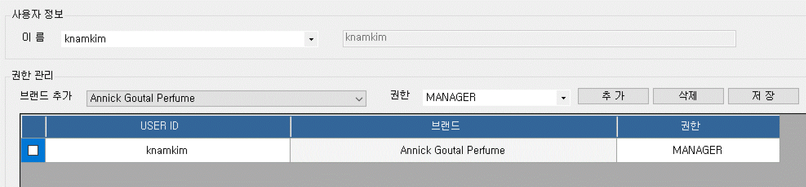

:sectnums:

== 인사정보 ==
개인별 인사 정보를 관리할 수 있는 기능입니다. 

=== 내 인사정보 관리 ===
'내 인사정보 관리' 메뉴에서는 개인별 인사 정보를 생성하고 수정할 수 있는 기능을 제공합니다. 

image::images/hr_user1.gif[]

기본정보:: 인사 기본 정보를 입력합니다.
가족사항:: 가족사항을 추가/수정할 수 있습니다. 
경력사항:: 경력사항을 추가/수정할 수 있습니다.
학력사항:: 학력사항을 추가/수정할 수 있습니다.
자격사항:: 자격증 관련 사항을 추가/수정할 수 있습니다.
급여:: 급여에 대한 정보를 조회할 수 있습니다. 

=== 직원 인사정보 관리 ===
정해진 권한에 따라서 직원의 인사정보를 관리할 수 있습니다. 정보를 수정할 사용자를 선택하고 더블클릭합니다. 해당 사용자의 인사 정보를 확인하실 수 있습니다. 

image::images/user_manage2.gif[]

원하시는 정보를 수정하고 [저장] 버튼을 눌러 수정한 내용을 저장합니다. 

IMPORTANT:: 인사 특이사항은 관리자에게만 보여집니다.

=== 인사 정보 권한 관리 ===
브랜드별 각 담당 직원의 권한을 설정하는 기능을 제공합니다. 

이름:: 권한을 설정할 사용자를 선택합니다.
브랜드 추가:: 권한을 설정할 브랜드를 선택합니다. 
권한:: 권한을 선택합니다.
추가:: 해당 권한을 추가합니다. 
삭제:: 선택한 권한을 삭제합니다.
저장:: 설정한 권한을 저장합니다.

