:sectnums:

== 실적 ==

실적 메뉴는 판매된 상품에 대한 매출, 매입, 재고 정보들을 확인할 수 있는 기능들을 제공하고 있다. 

=== 매출 실적 수기 입력 ===
일반적으로 매출 정보는 매출 데이터가 입력된 엑셀 파일을 기반으로 일괄 업데이트 하는 것이 편리하다. 하지만, 얼마 되지 않는 매출 건수에 대해서 수기로 입력할 수 있는 기능을 제공하고 있다. 

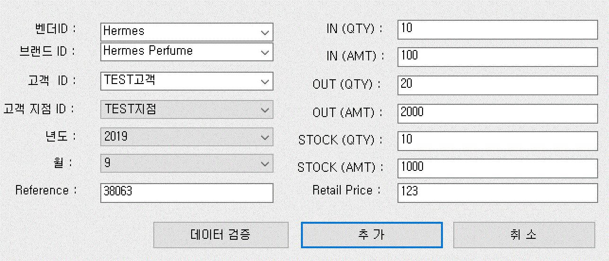

매출 정보를 입력하고, '데이터 검증' 버튼을 눌러서 Reference 번호의 유효성을 검증한 후 '추가' 버튼을 눌러서 매출 데이터를 추가한다. 

=== 매출 실적 엑셀 로딩 [컬럼 매핑] ===

'엑셀 로딩' 메뉴에서 자세히 설명하고 있다. 

=== 매출 실적 엑셀 로딩 [규칙 활용] ===

'엑셀 로딩' 메뉴에서 자세히 설명하고 있다. 

=== 매출 실적 수정 ===
매출 데이터에 대한 수정 기능을 제공한다. 수정할 데이터가 많은 경우에는 '엑셀 로딩' 기능을 통해서 일괄 업데이트 하는 것이 수월하지만, 많지 않은 양의 매출 데이터를 수정할 경우에는 해당 기능을 사용하는 것이 편할 수 있다. 

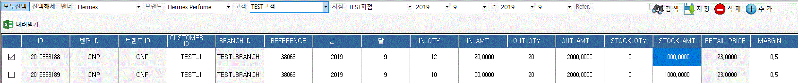

검색:: 설정한 검색 조건을 기준으로 매출 데이터를 검색한다. 

저장:: 매출 데이터를 수정하려면, 검색한 매출 데이터에서 수정하고자 하는 셀의 정보를 변경한 후 '저장' 버튼을 클릭한다. 

삭제:: 선택한 매출 데이터를 삭제한다. 

추가:: 새로운 매출 데이터를 추가할 수 있다. 

=== 보고용 리포트 생성 / 조회 ===

보고용 실적 데이터를 생성하거나 조회 하는 기능이다. 

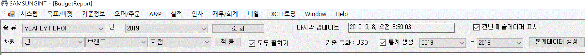

종류:: 1년치 매출 데이터에 대한 리포트를 보는 'YEARLY REPORT', 5년 동안의 매출 데이터 추이를 분석할 수 있는 '5년 매출 비교' 리포트 기능을 선택할 수 있다. 

년:: 매출 데이터를 확인하고자 하는 year 를 선택한다. 

마지막 업데이트:: 보고용 매출 데이터 리포트는 통계 데이터를 기준으로 조회한다. 마지막 통계 데이터가 업데이트 된 날짜이다. 날짜가 오래된 경우, '통계 데이터 생성' 버튼을 눌러 최근 데이터로 갱신할 수 있다. 

전년 데이터 매출 표시:: 'Yearly Report' 인 경우 전년 매출데이터를 표시해준다. 

차원 :: 매출 데이터를 보는 계층 기준을 설정할 수 있는 기능이다. 기본은 '년'->'브랜드'->'지점'
으로 설정되어 있다. 만일 해당년의 브랜드별 매출을 보고자 한다면 '년'->'브랜드'->'브랜드' 로 설정하면 된다. 

모두 펼치기:: 리포트 내용을 모두 펼치거나 접는 기능이다. 

통계 생성:: 통게 데이터를 생성할 year 를 선택하고 '통계데이터 생성' 버튼을 눌러서 통계를 생성한다. 

조회:: 설정된 조건을 기준으로 리포트를 조회한다. 

==== YEARLY SALES REPORT ====

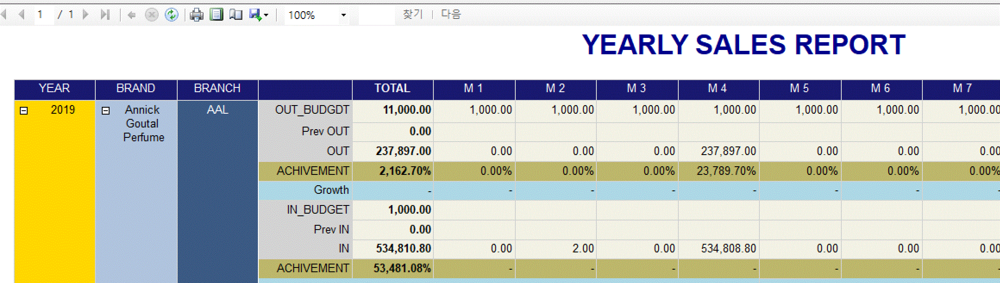

위의 화면은 'YEARLY REPORT' 예시 화면이다. 리포트에서는 각 월별 Sell In, Sell Out 에 대한 예산 , 실적, 예산 대비 실적 성취율을 확인할 수 있다. 상단의 '전년 데이터 표시' 를 선택하면 전년도의 매출 데이터 정보도 같이 확인할 수 있다. 

리포트의 상단에는 위와 같은 기능버튼들을 확인할 수 있다. 

리프레쉬:: 리포트를 새고 고친다.
프린트:: 해당 리포트를 프린트한다. 리포트 특성상 화면 레이아웃이 깨질 수 있는데 이러한 경우 엑셀로 저장해서 프린트 하기를 권장한다. 
미리보기:: 프린터할 리포트를 미리보기 할 수 있다. 
페이지설정:: 인쇄 페이지를 설정한다.
저장:: 엑셀, 워드, PDF 형식으로 해당 리포트를 저장할 수 있다. 

==== 5년 매출 데이터 비교 ====

리포트 메인 화면에서 종류를 '5년 매출 비교' 로 설정하고 '조회' 버튼을 클릭하면 5년 동안의  매출 데이터를 비교할 수 있다. 5년 매출 데이터는 'Sell Out' 에 대한 비교를 제공하고 있다. 

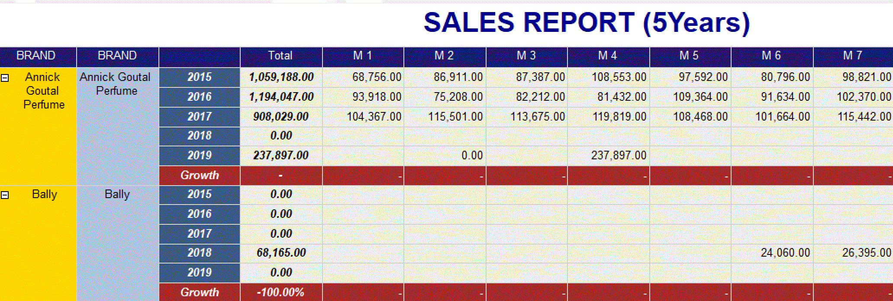

=== 매출 실적 보정 ===

매출 실적 보정은 동일한 제품에 관한 매출 정보를 보정하는 기능이다. 예를 들어, A 지점에 대한 '가' 라는 제품 매출이 10이고, B 지점에 대한 '가' 제품 매출이 2 라고 가정한다. 실제 보정하고자 하는 것은 A 지점의 매출 데이터를 B 지점의 매출 데이터를 제외한 값으로 수정하고자 하는 것이다. 

* 보정 후 A 지점 매출 데이터 = 보정 전 A 지점 매출 데이터 - B 지점 매출 데이터

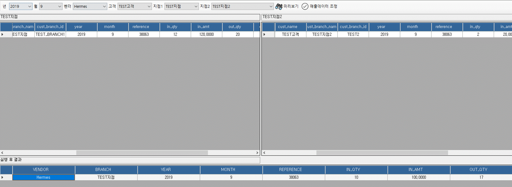

년:: 해당하는 year 를 선택한다. 
벤더:: 해당하는 벤더를 선택한다. 
고객:: 해당 고객을 선택한다.
지점1:: 수정하고자 하는 지점을 선택한다. (위의 예에서 A 지점)
지점2:: 제외할 매출 데이터를 갖고 있는 지점을 선택한다. (위의 예에서 B) 지점

매출 데이터 보정은 민감한 기능이기 때문에 '미리보기' 버튼을 클릭하여 해당 지점의 현재 매출 데이터와 수정후 매출 데이터를 확인한다. 위 그림에서 보면 'TEST지점' 의 매출 데이터와 'TEST지점2'의 매출 데이터를 확인할 수 있으며, 화면 하단에는 수정후에 'TEST지점' 의 매출 데이터가 어떻게 변경되는지를 보여주고 있다. 데이터에 문제가 없으면, '매출데이터 조정' 버튼을 클릭하여 매출 데이터를 보정한다. 

=== 매출 실적 조회 ===

'매출 실적 조회' 메뉴는 실제 매출 데이터를 확인하는 기능과 벤더에 송부하는 리포트를 만드는 기능을 제공한다. 

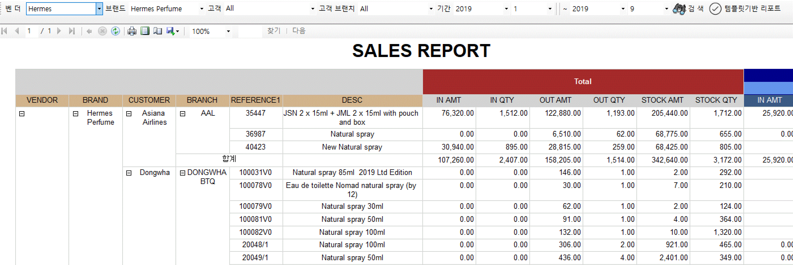

벤더:: 원하는 벤더를 선택한다. 
브랜드:: 원하는 브랜드를 선택한다.
고객:: 원하는 고객을 선택한다. 
고객 브랜치:: 원하는 고객 지점을 선택한다. 
기간:: 원하는 기간 범위를 설정한다. 
검색:: 주어진 조건을 기반으로 리포트를 생성한다. 

생성된 리포트를 보면 월별 IN_AMT,IN_QTY,OUT_AMT,OUT_QTY,STOCK_AMT,STOCK_QTY 그리고 Total 정보를 보여주고 있는 것을 확인할 수 있다. 

==== 템플릿 기반 리포트 ====
실제 '매출실적 조회' 메뉴는 검색한 매출 데이터를 기반으로 벤더에게 송부할 매출 리포트를 작성하는 용도로 사용된다.  각 벤더마다 송부하는 매출 리포트는 서로 다른 양식을 사용하고 있다. '템플릿 기반 리포트' 버튼을 클릭하면 다양한 리포트 형식에 맞춰서 리포트를 생성할 수 있는 화면을 볼 수 있다. 화면 설명에 앞서 Hermes 에 보내는 리포트 양식을 예를 들어 설명하겠다. 

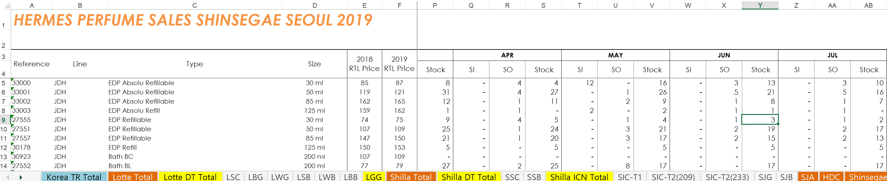

Hermes 리포트 양식을 보면 각 월마다 SI (Sell In) 수량, SO (Sell Out) 수량을 입력하게끔 되어 있다. 나머지 데이터들은 수식을 통해서 자동으로 값이 채워지게 되어 있는 구조이다. 그리고, 각 Sheet 는 개별 고객 지점의 매출 데이터를 입력해야 한다. 이러한 경우, 이전에는 해당 월의 SI 수량과 SO 수량을 일일이 제품별로 확인해서 입력해야 했기 때문에 많은 시간이 소요되었다. STA 시스템을 활용하면 이미 업로드된 매출 데이터를 기반으로 해당 값들을 자동으로 채워 줄 수 있다. 우선 '템플릿 기반 리포트' 메뉴을 클릭한다. 

===== 엑셀 템플릿 파일 불러오기 =====
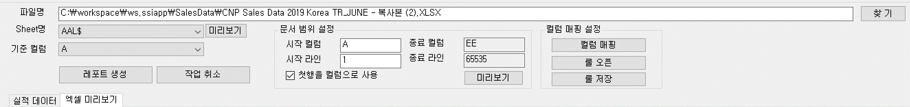

파일명:: 벤더에 송부할 리포트 양식 엑셀 파일을 선택한다. 
Sheet명:: 해당 엑셀 파일의 데이터 구조를 확인해야 하기 때문에 적당한 sheet 를 선택한다. 
미리보기:: 미리보기 버튼을 눌러서 해당 엑셀 데이터을 확인한다. 

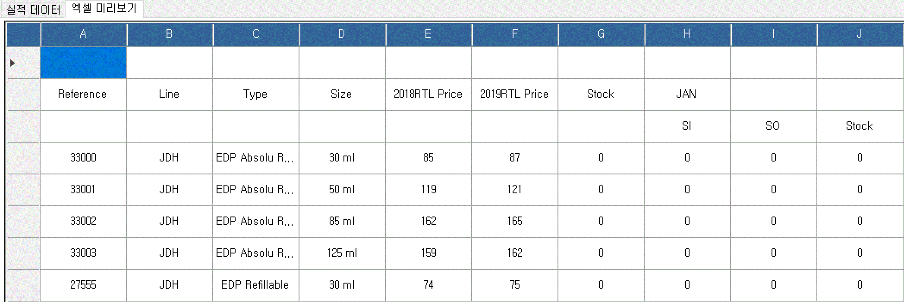

해당 엑셀 파일의 내용을 프로그램 안에서 확인할 수 있다. 

===== 기준 컬럼 선택 =====
기준 컬럼:: 상품의 reference 가 포함된 컬럼을 선택한다. 위의 예에서는 'A' 컬럼에 상품 reference 번호가 있는 것을 확인할 수 있다. 컬럼 'A' 를 선택한다. 

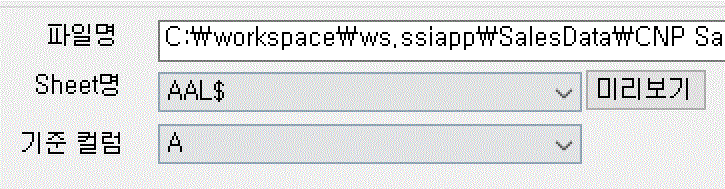

IMPORTANT:: 문서범위 설정 기능은 현재 버전에서는 특별히 설정할 필요가 없다. 나중에 복잡한 템플릿이 존재할 경우를 대비해서 준비한 기능이다. 

===== 컬럼 매핑 =====
시스템의 매출 데이터와 엑셀 파일의 컬럼을 매핑하기 위하여 사용하는 기능이다. 정확한 매핑룰을 설정해야 한다. '컬럼 매핑' 버튼을 클릭한다. 

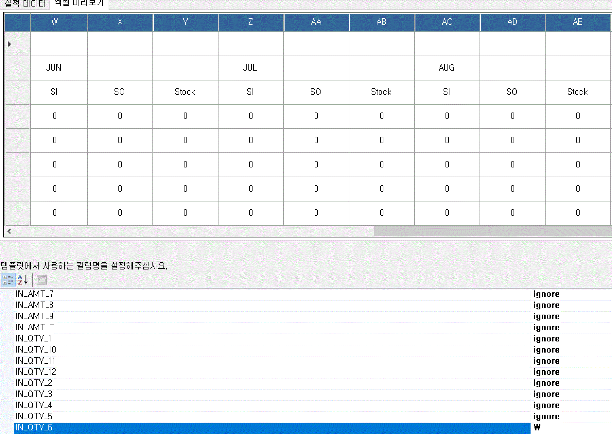

예를 들어 6월 매출 리포트를 만들어야 한다면, 시스템의 매출 데이터에서 6월 매출 데이터 중에서 필요한 매출 데이터를 엑셀의 컬럼과 매핑해주는 설정을 해야 한다. 시스템에서는 이름에서 짐작할 수 있듯이, IN_QTY_6, OUT_QTY_6 이 해당 매출 데이터값이 포함되어 있는 항목이다. 해당 항목을 엑셀의 W, X 컬럼에 채워 넣으면 되기 때문에 하단의 매핑 화면에서 IN_QTY_6 은 W 컬럼에, OUT_QTY_6 은 X 컬럼으로 매핑을 설정한다. 필요 없는 항목들은 기본값인 'ignore' 로 설정한 채로 놓아두면 된다. 

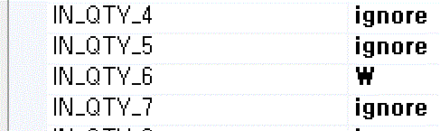

한번 설정한 매핑룰은 저장해두면 나중에 재활용할 수 있다. 

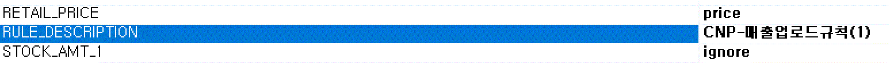

'RULE DESCRIPTION' 항목에 저장된 이름으로 현재 설정한 매핑룰을 저장할 수 있다. 저장된 룰은 '룰 오픈' 메뉴를 통하여 다시 불러올 수 있다. 

===== 리포트 생성 =====

모든 설정을 한 후에 '레포트 생성' 버튼을 클릭한다.

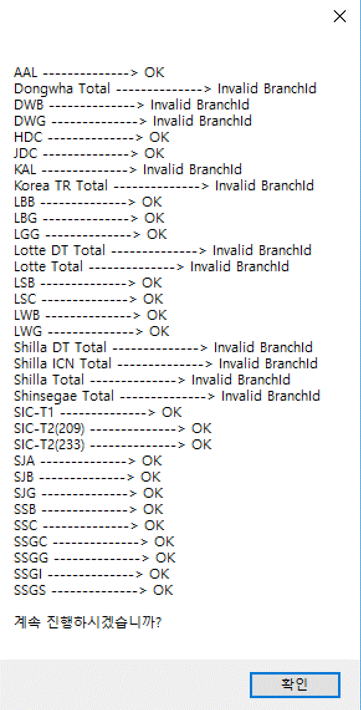

IMPORTANT:: 프로그램에서는 현재 엑셀의 모든 sheet 를 대상으로 현재 설정된 룰을 기반으로 매출 데이터를 업데이트 한다. 기능이 정상적으로 동작하기 위해서는 각 sheet 의 이름이 각 고객 지점이름과 일치하여야 한다. 일치하지 않는 경우 해당 sheet 의 데이터은 업데이트 되지 않는다. 현재 상태로 계속 진행하려면 '확인' 버튼을 클릭한다. 시스템의 매출 데이터가 선택한 엑셀 파일의 데이터를 자동으로 업데이트 한다. 

