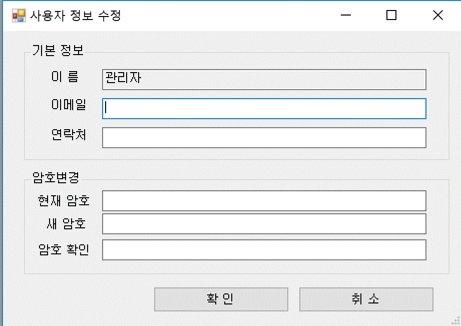

:sectnums:

== System 메뉴 ==
프로그램의 메인창에서 [시스템] 메뉴에 있는 기능을 설명합니다.

image::images/file_menu.gif[]

=== 사용자 등록 ===
로그인 창을 통한 사용자 생성외에도, [시스템]->[사용자 등록] 메뉴를 통해서도 새로운 계정을 생성할 수 있습니다. 사용자 ID 와 암호, 그리고 추가 정보들을 입력합니다. 사용자 ID 와 암호는 필수 항목입니다. 

IMPORTANT:: 해당 기능은 관리자 권한이 필요합니다. 

image::images/signup.gif[800,400]

=== 사용자 관리 ===
사용자의 권한을 수정할 수 있는 기능입니다. 일반 사용자는 해당 기능을 사용하실 수 없습니다. 

=== 사용자 정보 수정 ===
현재 로그인한 사용자의 정보를 수정하는 기능입니다.

사용자 정보 수정 화면에서는 기본 정보, 암호 변경 기능을 제공합니다. 인적 사항 정보 수정은 [인사] -> [내 인사정보 관리] 에서 가능합니다.

. 기본 정보 : 사용자 이메일과 연락처 정보를 입력합니다.
. 암호 변경 : 암호를 변경하고자 하는 경우 기존 암호와 새로운 암호를 입력합니다.

IMPORTANT: 사용자 권한 정보는 일반 사용자는 변경할 수 없고, SUPER USER 권한을 갖고 있는 사용자만 변경할 수 있습니다.
