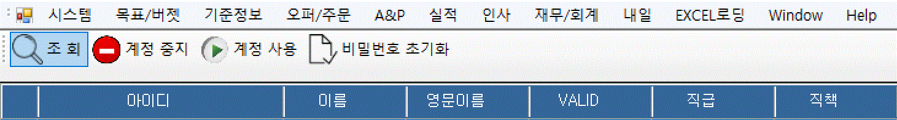
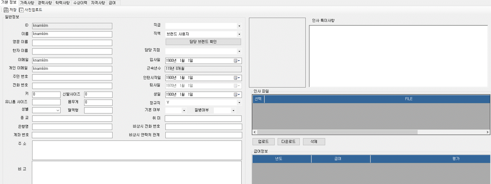

:sectnums:

== System 메뉴 ==
프로그램의 메인창에서 [시스템] 메뉴에 있는 기능을 설명한다.

image::images/file_menu.gif[]

=== 사용자 등록 ===
로그인 창을 통한 사용자 생성외에도, [시스템]->[사용자 등록] 메뉴를 통해서도 새로운 계정을 생성할 수 있다. 사용자 ID 와 암호, 그리고 추가 정보들을 입력한다. 사용자 ID 와 암호는 필수 항목이다. 해당 기능은 관리자 권한이 필요합니다. 

image::images/signup.gif[800,400]

=== 사용자 관리 ===
사용자의 권한을 수정할 수 있는 기능입니다. 일반 사용자는 해당 기능을 사용하실 수 없습니다. 

조회:: 사용자 정보를 조회합니다.
계정 중지:: 선택한 사용자 계정을 중지합니다. 
계정 사용:: 선택한 사용자 계정을 활성화합니다. 
비밀번호 초기화:: 선택한 사용자의 비밀번호를 초기화 합니다. 

==== 사용자 권한 및 정보 수정 ====
정보를 수정할 사용자를 선택하고 더블클릭합니다. 해당 사용자의 인사 정보를 확인하실 수 있습니다. 

원하시는 정보를 수정하고 [저장] 버튼을 눌러 수정한 내용을 저장합니다. 

IMPORTANT:: 인사 특이사항은 관리자에게만 보여집니다.

=== 사용자 정보 수정 ===
현재 로그인한 사용자의 정보를 수정하는 기능이다.

image::images/edit_user.gif[800,600]

사용자 정보 수정 화면에서는 기본 정보, 암호 변경 기능을 제공합니다. 인적 사항 정보 수정은 [인사] -> [내 인사정보 관리] 에서 가능합니다.

. 기본 정보 : 사용자 이메일과 연락처 정보를 입력한다.
. 암호 변경 : 암호를 변경하고자 하는 경우 기존 암호와 새로운 암호를 입력한다.

IMPORTANT: 사용자 권한 정보는 일반 사용자는 변경할 수 없고, SUPER USER 권한을 갖고 있는 사용자만 변경할 수 있다.
